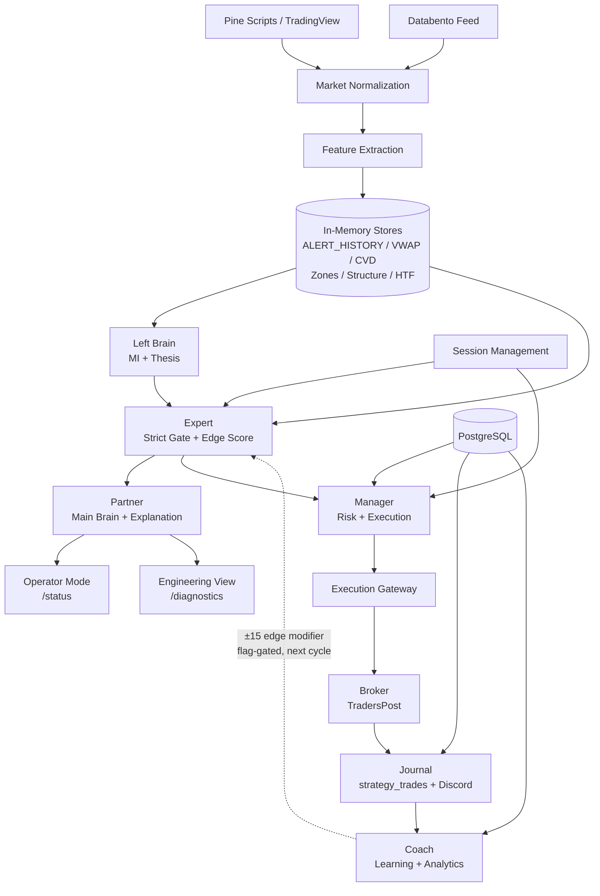
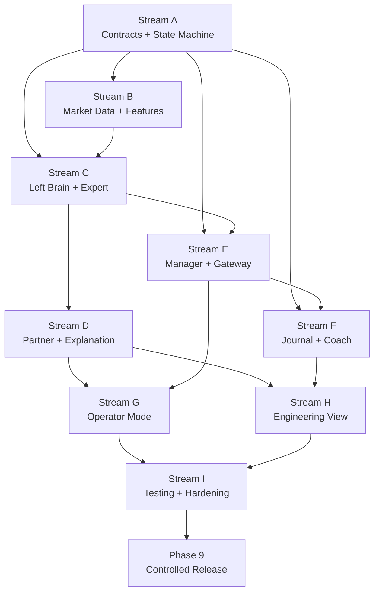

# IMPLEMENTATION_ROADMAP_V1.md
## AI Trading Partner — Version 1 Implementation and Release Plan
**Phase 3 — July 2026**
**DOCUMENTATION AND PLANNING ONLY — NO CODE CHANGES**

---

## Source-of-Truth Order

When resolving conflicts between documents, this order applies:

1. `SYSTEM_ARCHITECTURE_V1.md`
2. `PRODUCT_SPEC_V1.md`
3. `PLATFORM_BLUEPRINT.md`
4. Current repository implementation

---

## Table of Contents

1. [Current-State Baseline](#section-1--current-state-baseline)
2. [V1 Gap Analysis](#section-2--v1-gap-analysis)
3. [Implementation Principles](#section-3--implementation-principles)
4. [Build Streams](#section-4--build-streams)
5. [Dependency Graph](#section-5--dependency-graph)
6. [Implementation Phases](#section-6--implementation-phases)
7. [Task Cards](#section-7--task-cards)
8. [Priority and Risk Scoring](#section-8--priority-and-risk-scoring)
9. [Test Strategy](#section-9--test-strategy)
10. [Release Gates](#section-10--release-gates)
11. [Technical Debt Register](#section-11--technical-debt-register)
12. [V1 Scope Control](#section-12--v1-scope-control)
13. [Post-V1 Roadmap](#section-13--post-v1-roadmap)
14. [Master Execution Table](#section-14--master-execution-table)
15. [Recommended First Implementation Batch](#section-15--recommended-first-implementation-batch)
16. [Open Conflicts and Required Decisions](#open-conflicts-and-required-decisions)

---

---

# SECTION 1 — CURRENT-STATE BASELINE

## Assessment Method

Evidence drawn from: `PLATFORM_BLUEPRINT.md` subsystem inventory, `SYSTEM_ARCHITECTURE_V1.md` acceptance criteria, `.local/state/check_*.sh` smoke scripts (40 scripts confirmed), primary regression workflows (`check_parity.sh`, `check_scalp_golden.sh`, `check_dual_sim.sh`, `check_breakout_mode.sh`), and memory files documenting platform evolution.

**V1-Ready definition:** A subsystem is V1-ready if it is complete, tested, production-deployed, its interface matches the architecture contract, and it requires no modification to satisfy any acceptance criterion.

---

## 1. Databento Ingestion

| Field | State |
|---|---|
| **Current status** | Complete, flag-gated (`DATABENTO_ENABLED=1`) |
| **Location** | `app.py` — `DatabentoBrain` class, `_databento_structure_trigger`, `_databento_bar_scan` |
| **Production status** | Deployed; requires `DATABENTO_API_KEY` secret to activate. Reports OFFLINE when key absent. |
| **Test coverage** | No dedicated Databento smoke test in `.local/state/`. Integration tested indirectly via `check_dual_sim.sh` (accepts `"databento_scan"` trigger). |
| **Interface maturity** | `get_databento_status()` endpoint exists. Status reported in Engineering View. No versioned interface contract document yet. |
| **Integration maturity** | Injects into VWAP/ATR stores. `_databento_structure_trigger` spawns `_databento_bar_scan` on non-duplicate signals. |
| **Known limitations** | Feed status panel is Engineering View only. No Operator Mode staleness alert when Databento goes OFFLINE while live. |
| **V1-ready** | PARTIAL — Functional but lacks a versioned interface contract and dedicated health smoke test. |
| **Requires modification** | No code change. Needs contract documentation and health verification task. |
| **Should remain untouched** | YES — Databento ingestion behavior must not be rewritten. |

---

## 2. Pine / TradingView Fallback Ingestion

| Field | State |
|---|---|
| **Current status** | Complete — primary signal source in production |
| **Location** | `artifacts/tradingview-webhook/pine/` (Pine scripts), `app.py` (webhook handler ~line 42194+) |
| **Production status** | Live — all signals arrive via TradingView HTTP POST to `/webhook` |
| **Test coverage** | `check_parity.sh`, `check_scalp_golden.sh`, `check_dual_sim.sh`, `check_breakout_mode.sh` — all replay webhook payloads |
| **Interface maturity** | Webhook payload schema is implicit (no versioned contract document). `ALERT_TYPES` registry is the de facto schema. |
| **Integration maturity** | Full — every feature of the platform receives data through this path |
| **Known limitations** | Payload schema not explicitly versioned. Adding a new contract requires editing Pine scripts AND app.py registry. Pine script auto-detect defaults unrecognized tickers to MGC (see Open Conflicts). |
| **V1-ready** | PARTIAL — Functionally complete. Missing explicit payload schema versioning and a documented fallback boundary with Databento. |
| **Requires modification** | No code change. Needs boundary documentation and schema version record. |
| **Should remain untouched** | YES |

---

## 3. Market Normalization

| Field | State |
|---|---|
| **Current status** | Complete |
| **Location** | `app.py` webhook handler — `alert_type` strip/upper, `resolve_instrument()`, `_is_structure_bridge_type()`, `ALERT_TYPES` gate |
| **Production status** | Live |
| **Test coverage** | Implicitly tested by all 4 regression workflows. `check_instrument_isolation.sh` covers instrument resolution smoke. |
| **Interface maturity** | No versioned normalization contract. The `ALERT_TYPES` registry is the implicit schema. |
| **Known limitations** | Three overlapping resolver functions (`resolve_instrument()`, `instrument_of()`, `_instrument_from_text()`) — inconsistent use across codebase. |
| **V1-ready** | PARTIAL — Functional. Open Conflict: principle 14 ("no subsystem may silently default an unknown instrument to MGC") vs. current Pine script behavior that defaults to MGC. |
| **Requires modification** | No code change. Needs conflict resolution and instrument-default behavior documentation. |
| **Should remain untouched** | YES — normalization behavior not to be changed without explicit task authorization |

---

## 4. Feature Extraction

| Field | State |
|---|---|
| **Current status** | Complete |
| **Location** | `app.py` — all per-instrument store update paths within the webhook handler |
| **Production status** | Live |
| **Test coverage** | Exercised by all regression workflows. No isolated feature-extraction unit tests. |
| **Interface maturity** | Implicit — stores are read directly by downstream functions, no formal interface. |
| **Known limitations** | `ALERT_HISTORY` is shared across instruments with per-instrument filtering (by convention, not enforcement). Structure bridge (fast-entry) runs unconditionally as intended. |
| **V1-ready** | COMPLETE — Fully functional. Feature freshness tracking exists via VWAP age and alert timestamps. |
| **Requires modification** | None |
| **Should remain untouched** | YES |

---

## 5. Left Brain (Market Intelligence + Thesis)

| Field | State |
|---|---|
| **Current status** | Complete (Phase 1B + 2, July 2026) |
| **Location** | `left_brain_market_intelligence.py`, `app.py` (integration, obs buffer, `/lb-thesis`, `/lb-vwap-authority`, `/lb-shadow-report`, `/lb-thesis-obs`) |
| **Production status** | Live — pending re-publish (obs-infra closure changes not yet in production) |
| **Test coverage** | 128 tests documented in memory (31 unit + 50 shadow + 47 phase2). Indirect coverage via `check_scalp_golden.sh`, `check_swing_golden.sh`. |
| **Interface maturity** | Output block exists but not formally versioned as `v2` per the architecture contract. `_LB_THESIS_OBS_BY_INST` obs buffer endpoint is `v2` by route naming but not by schema version field. |
| **Known limitations** | `_LB_THESIS_OBS_BY_INST` endpoint has no dashboard panel (backend-only). Confidence hysteresis reversal requires `prev=None` reset — not documented in interface contract. |
| **V1-ready** | PARTIAL — Functional and tested. Missing: formal `_version: "v2"` field in thesis output; obs buffer dashboard panel deferred (HIDE per Product Spec). |
| **Requires modification** | Minor — add `_version` field to thesis output contract. No behavior change. |
| **Should remain untouched** | Behavior YES. Interface contract needs one additive field. |

---

## 6. Expert (Strict Gate + Edge Score)

| Field | State |
|---|---|
| **Current status** | Complete |
| **Location** | `app.py` — `evaluate_strict_setup()`, `_analysis_edge_breakdown()`, `full_analysis()` |
| **Production status** | Live |
| **Test coverage** | `check_parity.sh` (gate correctness), `check_scalp_golden.sh` (edge score), `check_swing_golden.sh` (SWING gate), `check_entry_quality.sh`, `check_mi_strategy_filter.sh`, `check_trend_brake.sh`, `check_structure_reversal_demote.sh`, `check_mi_fallback.sh` |
| **Interface maturity** | Output is the full `full_analysis()` return dict. Not formally versioned with `_version: "v1"` field. Single return path enforced. |
| **Known limitations** | `full_analysis()` result dict is large (~60+ keys). Key whitelist at `/status` endpoint prevents all keys from reaching the dashboard without explicit addition. |
| **V1-ready** | PARTIAL — Complete and well-tested. Missing: `_version` field in Expert output; acceptance criterion 4.3 (edge score components correct) needs explicit verification run. |
| **Requires modification** | Minor — add `_version` field to Expert output. No behavior change. |
| **Should remain untouched** | Behavior YES. Additive interface versioning only. |

---

## 7. Partner (Main Brain + Explanation Layer)

| Field | State |
|---|---|
| **Current status** | Complete |
| **Location** | `app.py` — `_mb_orchestrate()`, `_mb_learning_snapshot()`, `compute_main_brain()`, Brain Contract JS (10 render functions), Avatar Intelligence Engine |
| **Production status** | Live |
| **Test coverage** | `check_main_brain_cognitive.sh`, `check_main_brain_judge.sh`, `check_scalp_advisory.sh`, `check_advisor.sh`, `check_stalk_active.sh` |
| **Interface maturity** | Output not formally versioned. Three-layer rule (`_mb_orchestrate` → `_mb_learning_snapshot` → `compute_main_brain`) is documented in memory but not in a version field. |
| **Known limitations** | Seven decision-state explanations (WAIT, READY, EARLY, OPEN, THESIS_INVALIDATED, VETO_ACTIVE, MARKET_CLOSED) exist in the Product Spec but are not yet mapped to explicit response contracts. Avatar `mbMemory` placeholder not wired to Shared Trade Memory. |
| **V1-ready** | PARTIAL — Functional. Seven decision-state explanation contracts need verification against current output. |
| **Requires modification** | Minor — verify seven explanation states map to actual output fields. Add `_version` field. |
| **Should remain untouched** | Behavior YES. |

---

## 8. Manager (Risk Controls + Execution Coordination)

| Field | State |
|---|---|
| **Current status** | Complete |
| **Location** | `app.py` — `_check_auto_trade()`, `_training_gate()`, `safety_cfg()`, execution gateway section, `ACTIVE_TRADES_BY_INST`, `MANAGED_TRADES_BY_KEY` |
| **Production status** | Live |
| **Test coverage** | `check_training_gate.sh`, `check_training_grade.sh`, `check_training_metrics.sh`, `check_active_trade_mgmt.sh`, `check_prop_guard.sh`, `check_live_runner.sh`, `check_manual_order.sh`, `check_broker_send.sh` |
| **Interface maturity** | `gateway_debug` block exists. No formal `_version` field. Auto-trade arm state is in-memory with no versioned serialization. |
| **Known limitations** | Arm state resets on restart (intentional safety). No explicit entry-pending lifecycle state tracked in the result dict. |
| **V1-ready** | PARTIAL — Complete and well-tested. Missing: explicit ENTRY_PENDING state representation in state machine; `_version` field. |
| **Requires modification** | None for behavior. Interface versioning only. |
| **Should remain untouched** | YES |

---

## 9. Execution Gateway

| Field | State |
|---|---|
| **Current status** | Complete |
| **Location** | `app.py` — execution gateway section, `/traderspost` handler, `EXECUTION_MODE` routing, broker payload pre-send guard |
| **Production status** | Live |
| **Test coverage** | `check_broker_send.sh`, `check_prop_guard.sh`, `check_conditional_runner.sh` |
| **Interface maturity** | Canonical intent → per-provider adapter pattern exists. Not formally versioned. |
| **Known limitations** | Duplicate protection via `AUTO_FIRED_KEYS` is correct but not explicitly tested in a dedicated duplicate-execution test. |
| **V1-ready** | PARTIAL — Complete. Missing: dedicated duplicate-execution test (acceptance criterion 5.2); `_version` field. |
| **Requires modification** | None for behavior. Dedicated duplicate test needed. |
| **Should remain untouched** | YES — execution behavior must not be changed. |

---

## 10. Broker Integration

| Field | State |
|---|---|
| **Current status** | Complete — TradersPost provider, PickMyTrade adapter, paper, manual_only |
| **Location** | `app.py` — per-provider adapter in execution gateway section |
| **Production status** | Live (TradersPost in production) |
| **Test coverage** | `check_broker_send.sh` covers payload correctness in paper mode. No live broker rejection test (not possible in dev). |
| **Interface maturity** | Payload structure documented in memory. TradersPost connectivity probe exists. |
| **Known limitations** | No integration test for live broker rejection (cannot replicate in dev environment). Broker timeout behavior verified by code review only. |
| **V1-ready** | NEEDS VERIFICATION — Behavior complete. Acceptance criterion 5.3 (payload validation fires) needs an explicit test run. |
| **Requires modification** | None |
| **Should remain untouched** | YES |

---

## 11. Journal

| Field | State |
|---|---|
| **Current status** | Complete |
| **Location** | `app.py` — `_build_card_entry()`, `strategy_trades` DB section, Discord webhook sends, EOD report, Trade Management Analytics Sidecar |
| **Production status** | Live (pending re-publish for latest obs-infra changes) |
| **Test coverage** | Implicitly tested by regression workflows (Discord sends gated on `DISCORD_LIVE_ENABLED`). No isolated journal unit tests. |
| **Interface maturity** | `_build_card_entry()` is the single source. Not formally versioned. |
| **Known limitations** | Discord sends are best-effort with WARN logging on failure but no retry. Journal write failure does not surface to the operator. No dedicated journal test. |
| **V1-ready** | PARTIAL — Complete. Missing: dedicated journal write test; journal failure visibility; `_version` field. |
| **Requires modification** | None for behavior. |
| **Should remain untouched** | YES |

---

## 12. Coach (Learning + Analytics)

| Field | State |
|---|---|
| **Current status** | Complete (Adaptive Learning, Unified Learning Brain, Shared Trade Memory, Thesis Tracker, Trade Failure Analyzer, Decision Quality Analytics, Academy, Backtest, Baseline, TradeZella, Trade Idea Review) |
| **Location** | `app.py` — learning engine section, academy routes, backtest routes, `/review-idea` |
| **Production status** | Live (learning score influence, Learning Rule Engine active) |
| **Test coverage** | `check_learning_score_golden.sh`, `check_swing_flagoff_golden.sh`, `check_academy.sh`. No isolated Coach unit tests. |
| **Interface maturity** | Learning output feeds edge score ±15 (flag-gated, bounded 0.65–1.35). No formal `_version` field on learning output. |
| **Known limitations** | Coach failure does not notify operator. Thesis Tracker resolve/lesson not prominently displayed. Decision Quality has no UX. Coach output version field absent. |
| **V1-ready** | PARTIAL — Core learning functions complete. Missing: `_version` field; lesson/failure UI (deferred to HIDE per Product Spec). |
| **Requires modification** | None for behavior. Interface versioning only. |
| **Should remain untouched** | YES |

---

## 13. Operator Mode

| Field | State |
|---|---|
| **Current status** | Complete (React dashboard, Cockpit.tsx, 5-section live navigation) |
| **Location** | `artifacts/home/src/` — `Cockpit.tsx`, `Sentinel.tsx`, `VRMAvatar.tsx`, dashboard JS in `app.py` |
| **Production status** | Live — 3s poll, localStorage panel persistence, glass/retro themes |
| **Test coverage** | No automated UI tests. `check_main_brain_cognitive.sh`, `check_main_brain_judge.sh` test backend outputs that reach Operator Mode. |
| **Interface maturity** | Dashboard renders via Brain Contract JS (10 render functions). `/status` endpoint is the operator data contract. |
| **Known limitations** | Some DIAGNOSTIC-tier information (eval metrics, raw alert feed) may be accessible in current Operator Mode panels that should be Engineering View only (needs verification). Seven decision-state explanations may not be uniformly rendered. |
| **V1-ready** | NEEDS VERIFICATION — Acceptance criterion 3.2 (Engineering diagnostics isolated from Operator Mode) needs explicit audit. Criterion 2.4 (WAIT explains itself) needs verification. |
| **Requires modification** | Possible minor panel isolation if audit finds DIAGNOSTIC content in Operator Mode. |
| **Should remain untouched** | Behavior YES. Visual isolation may need small adjustment. |

---

## 14. Engineering View

| Field | State |
|---|---|
| **Current status** | Complete — `/diagnostics`, `/diagnostics-live`, `/eval-metrics`, per-gate PASS/FAIL, all analytic panels |
| **Location** | `app.py` — diagnostics routes, eval metrics section; dashboard advanced panels |
| **Production status** | Live (owner-only auth) |
| **Test coverage** | `check_analyst_pro.sh`, `check_game_plan.sh`, `check_session_quality.sh` touch engineering-layer outputs. No dedicated Engineering View auth test. |
| **Interface maturity** | Routes are owner-protected. `/diagnostics` and `/diagnostics-live` are not in OPEN_PATHS. |
| **Known limitations** | Auth model (proxy-level dashboardAuth) needs explicit acceptance criterion test. Engineering View must not alter trading state — this is enforced by code but not tested. |
| **V1-ready** | NEEDS VERIFICATION — Criterion 3.3 (diagnostics require auth) needs explicit test. Criterion 3.2 (isolated from Operator Mode) needs audit. |
| **Requires modification** | None if audit passes. |
| **Should remain untouched** | YES |

---

## 15. Research and Backtest Lab

| Field | State |
|---|---|
| **Current status** | Complete — Backtest Engine, Baseline Engine, Scalp Research Engine, Scalp Strategy Advisory |
| **Location** | `backtest_engine.py`, `bt_baseline.py`, `scalp_live_sim.py`, `app.py` (`/backtest/*`, `/scalp-research`, `/scalp-strategy`) |
| **Production status** | Live (owner-only) |
| **Test coverage** | No dedicated backtest smoke tests in `.local/state/`. `check_scalp_advisory.sh` touches advisory output. |
| **Interface maturity** | Routes are owner-protected. Walled off from money path (INSERT/SELECT only in own tables). |
| **Known limitations** | No production-verification test for backtest engine. CSV upload → results flow not smoke-tested. |
| **V1-ready** | NEEDS VERIFICATION — Complete per blueprint. Acceptance criterion for Research screen (not in the 38 architecture criteria) needs basic smoke. |
| **Requires modification** | None |
| **Should remain untouched** | YES |

---

## 16. Journal and Performance Screen

| Field | State |
|---|---|
| **Current status** | Complete — Today's Trades panel, equity curve (today), EOD report, trade management analytics display |
| **Location** | Dashboard — strategy_trades queries, equity curve display section |
| **Production status** | Live |
| **Test coverage** | `check_trade_mgmt_math.sh` covers sidecar math. No dedicated Journal/Performance screen test. |
| **Interface maturity** | `/status` feeds today's trades. No dedicated performance endpoint — data comes from strategy_trades queries. |
| **Known limitations** | `strategy_trades` stores raw TV symbols (MGC1!) but dashboard reads canonical (MGC) — per `strategy-trades-symbol-mismatch.md` memory, this required a fix. Today-only equity curve (no history). |
| **V1-ready** | NEEDS VERIFICATION — Symbol mismatch fix should be confirmed. Equity curve is today-only (intentional per Product Spec). |
| **Requires modification** | None if symbol mismatch fix is confirmed in current code. |
| **Should remain untouched** | YES |

---

## 17. Coach and Academy Screen

| Field | State |
|---|---|
| **Current status** | Complete — Academy curriculum, `/academy/ask`, Trade Idea Review, TradeZella import, Scalp Research panel |
| **Location** | `app.py` (`/academy/*`, `/review-idea`, TradeZella routes) |
| **Production status** | Live (owner-only) |
| **Test coverage** | `check_academy.sh` covers academy routes. |
| **Interface maturity** | Owner-protected routes. Academy normalizer is a fixed dashboard contract. |
| **Known limitations** | Bot Training Mode progress has no dedicated coaching UI (HIDE per Product Spec). Decision Quality and Trade Failure coaching displays are PARTIAL (backend built, no dedicated coaching panel). |
| **V1-ready** | COMPLETE for V1 scope (key Coach features present; advanced coaching panels are HIDE per Product Spec) |
| **Requires modification** | None |
| **Should remain untouched** | YES |

---

## 18. Session Management

| Field | State |
|---|---|
| **Current status** | Complete |
| **Location** | `app.py` — `market_session_status()`, CME/COMEX hours, US holiday list |
| **Production status** | Live — closed-override runs LAST in `full_analysis()` |
| **Test coverage** | `check_parity.sh` implicitly validates session-closed state. `check_breakout_mode.sh` depends on correct session behavior. |
| **Interface maturity** | `market_session_status()` returns structured status dict. No versioned contract. |
| **Known limitations** | Holiday list requires manual updates each year. Half-day session (~13:00 ET) handling exists but not explicitly smoke-tested. |
| **V1-ready** | COMPLETE — Fully functional. Needs `_version` field only. |
| **Requires modification** | None |
| **Should remain untouched** | YES |

---

## 19. Market Status

| Field | State |
|---|---|
| **Current status** | Complete — session indicator, VWAP staleness, ATR ratio, cross-market alignment, ForexFactory news |
| **Location** | `app.py` — various status sections, `/status` endpoint |
| **Production status** | Live |
| **Test coverage** | `check_cross_market.sh`, indirect through all regression tests |
| **Interface maturity** | `/status` is the primary dashboard data contract — whitelisted keys only. |
| **Known limitations** | Dashboard's "last updated" clock distinguishes staleness. ForexFactory news is DISPLAY-ONLY and NEVER feeds the gate. |
| **V1-ready** | COMPLETE |
| **Requires modification** | None |
| **Should remain untouched** | YES |

---

## 20. Decision Timeline

| Field | State |
|---|---|
| **Current status** | PARTIAL — `_LAST_DECISION_TRACE` exists, `build_legacy_decision_trace()` populates it, `/decision-trace` route exposes it. No dashboard panel renders it. No persistent timeline DB table. |
| **Location** | `app.py` — `_LAST_DECISION_TRACE` store, `build_legacy_decision_trace()`, `/decision-trace` route |
| **Production status** | Live (queryable via direct API call only) |
| **Test coverage** | No dedicated smoke test. |
| **Interface maturity** | Route exists, owner-protected. Data queryable but not dashboard-visible. |
| **Known limitations** | Decision trace is in-memory only (not persisted to DB). No dashboard panel. No timeline that records state machine transitions with timestamps. |
| **V1-ready** | PARTIAL — Architecture requires every live decision to be traceable (principle 13). Current trace is per-request in-memory, not a durable timeline. The 38 acceptance criteria do not explicitly require a persisted timeline for V1, so this is PARTIAL but not a V1 BLOCKER for the acceptance criteria. |
| **Requires modification** | Needs Engineering View panel visibility at minimum. No behavior change to money path. |
| **Should remain untouched** | Behavior YES. |

---

## 21. State Machine

| Field | State |
|---|---|
| **Current status** | IMPLICIT — The 11 canonical states defined in `SYSTEM_ARCHITECTURE_V1.md` are emergent from component states. No explicit state machine class or enum. |
| **Location** | Distributed across `app.py` — market_session_status(), ACTIVE_TRADES_BY_INST, arm state, gate verdict, boot initialization |
| **Production status** | Live (emergent behavior) |
| **Test coverage** | State transitions implicitly covered by: `check_parity.sh` (OBSERVING→READY), `check_training_gate.sh` (ARMED suppression), `check_active_trade_mgmt.sh` (ACTIVE TRADE). No explicit state machine tests. |
| **Interface maturity** | No formal state machine interface. State is computed, not stored. |
| **Known limitations** | No single function returns "current platform state." Engineers must infer state from multiple fields. Forbidden transitions are enforced by convention (code logic), not by a state machine guard. |
| **V1-ready** | NEEDS VERIFICATION — Acceptance criterion 4.2 (gate produces correct verdict) is covered. But the state machine as a formal, testable contract is absent. |
| **Requires modification** | Documentation and test coverage. No behavior change. |
| **Should remain untouched** | Behavior YES. |

---

## 22. Internal Message Contracts

| Field | State |
|---|---|
| **Current status** | IMPLICIT — The 11 logical message types defined in `SYSTEM_ARCHITECTURE_V1.md` exist as function calls and store updates within one Flask process. No explicit message bus, no explicit contract validation. |
| **Location** | Distributed across `app.py` |
| **Production status** | Live (implicit) |
| **Test coverage** | Individual outcomes tested. No contract validation tests that verify field presence/schema of each message event. |
| **Interface maturity** | Not versioned. No schema validation. |
| **Known limitations** | Contract violations (missing required field) would only surface as downstream `KeyError` or silent None. No contract-level validation layer. |
| **V1-ready** | PARTIAL — Behavior correct. Formal contract tests absent. |
| **Requires modification** | Contract documentation and tests. No behavior change. |
| **Should remain untouched** | Behavior YES. |

---

## 23. Risk Controls

| Field | State |
|---|---|
| **Current status** | Complete — Per-asset safety controls, Prop Firm Protection, Bot Training Mode, duplicate prevention, Advisor review gate |
| **Location** | `app.py` — safety_cfg(), prop guard section, training mode section, AUTO_FIRED_KEYS |
| **Production status** | Live |
| **Test coverage** | `check_prop_guard.sh` (comprehensive: 8230 bytes), `check_training_gate.sh`, `check_training_grade.sh`, `check_training_metrics.sh` |
| **Interface maturity** | `safety_cfg()` resolver is well-structured. Prop guard is the most thoroughly tested subsystem. |
| **Known limitations** | Prop firm account setup has no UI (configuration via API only). |
| **V1-ready** | COMPLETE — Best-tested subsystem in the platform. |
| **Requires modification** | None |
| **Should remain untouched** | YES |

---

## 24. Duplicate Execution Protection

| Field | State |
|---|---|
| **Current status** | Complete — `AUTO_FIRED_KEYS` dedup store, per-setup key registration, `/clear-fired-keys` endpoint |
| **Location** | `app.py` — AUTO_FIRED_KEYS, `_check_auto_trade()` dedup check, market_state_cache (persists across restarts) |
| **Production status** | Live |
| **Test coverage** | `check_broker_send.sh` validates broker payload. No dedicated duplicate-execution test that sends the same signal twice and verifies exactly one order. |
| **Interface maturity** | Dedup key format: instrument + direction + zone key composite. |
| **Known limitations** | Absence of a dedicated duplicate test is a gap (acceptance criterion 5.2). |
| **V1-ready** | NEEDS VERIFICATION — Behavior complete. Acceptance criterion test absent. |
| **Requires modification** | None for behavior. Needs dedicated test. |
| **Should remain untouched** | YES |

---

## 25. Database Persistence

| Field | State |
|---|---|
| **Current status** | Complete — ~40 tables, INSERT/SELECT only in app, boot readiness probe, `*_DB_READY` flags, market_state_cache restore |
| **Location** | `app.py` — DB init, all write paths, market_state_cache table, open_trades, strategy_trades |
| **Production status** | Live |
| **Test coverage** | All regression workflows depend on DB. `check_prop_guard.sh` tests DB-backed safety overrides. Boot restore tested indirectly. |
| **Interface maturity** | `*_DB_READY` flags gate all DB-dependent subsystems. No DDL at runtime. |
| **Known limitations** | Production replica vs. live DB divergence (per memory file): `executeSql environment:production` can show tables that the running deployment can't see. Re-publish is the fix. |
| **V1-ready** | COMPLETE — Core persistence is solid. |
| **Requires modification** | None |
| **Should remain untouched** | YES |

---

## 26. Deployment and Production Observability

| Field | State |
|---|---|
| **Current status** | Complete — Express + Flask + Analysis Bot supervised by `prod-start.sh`, health probe at `/api/healthz`, eval metrics heartbeat, request logger with `_redact()` |
| **Location** | `scripts/prod-start.sh`, `scripts/prod-build.sh`, `artifacts/api-server/src/`, `app.py` (eval metrics, diagnostics) |
| **Production status** | Live (pending re-publish for latest changes) |
| **Test coverage** | Health probe tested by acceptance criterion 1.1. No automated production smoke test script in `.local/state/`. |
| **Interface maturity** | `/api/healthz` → `{ status: "ok" }`. Express proxy whitelist gates all routes. |
| **Known limitations** | Current Replit registry issue (ticket #481442) means re-publish is pending. Eight consecutive build failures at the manifest PUT step. |
| **V1-ready** | NEEDS VERIFICATION — Infrastructure is complete but production re-publish is pending. All obs-infra and SWEEP_RECLAIM fixes are in dev, not yet in production. |
| **Requires modification** | None — re-publish when Replit resolves registry issue. |
| **Should remain untouched** | YES |

---

---

# SECTION 2 — V1 GAP ANALYSIS

## Gap Classification

- **COMPLETE** — Implemented, tested, matches contract
- **PARTIAL** — Implemented but missing test, version field, or minor contract gap
- **MISSING** — Not implemented
- **PRESENT BUT NONCOMPLIANT** — Implemented differently from the contract
- **NEEDS VERIFICATION** — Implemented but not confirmed by a passing test
- **OUT OF V1 SCOPE** — Explicitly deferred per Product Spec

---

## Architecture Acceptance Criteria (38 criteria from SYSTEM_ARCHITECTURE_V1.md)

| ID | Requirement | Source | Current State | Gap | Risk | Required Work | Dependency | Priority |
|---|---|---|---|---|---|---|---|---|
| AC-1.1 | Platform starts correctly within 3s, all DB_READY flags True | ARCH §8 | NEEDS VERIFICATION | No automated boot time measurement | MEDIUM | Add boot-time measurement to Phase 0 baseline | None | HIGH |
| AC-1.2 | Market state cache restores on boot | ARCH §8 | NEEDS VERIFICATION | No dedicated cache-restore smoke test | MEDIUM | Verify via boot log evidence | DB | HIGH |
| AC-1.3 | Active trades restore as INERT on boot | ARCH §8 | COMPLETE | open_trades boot restore implemented | LOW | Confirm via boot log | DB | HIGH |
| AC-1.4 | Auto-trade arm resets to OFF on boot | ARCH §8 | COMPLETE | In-memory arm state resets by design | LOW | Confirm via boot log | None | HIGH |
| AC-1.5 | All instruments initialize (MGC/MNQ/MES/MYM) | ARCH §8 | NEEDS VERIFICATION | No smoke test verifying all 4 instruments initialize | MEDIUM | Add to Phase 0 baseline verification | None | HIGH |
| AC-2.1 | Operator Mode loads within 5s, no console errors | ARCH §8 | NEEDS VERIFICATION | No automated browser load test | MEDIUM | Manual verification + screenshot evidence | Dashboard | MEDIUM |
| AC-2.2 | Session status accurate (OPEN/HALT/CLOSED) | ARCH §8 | COMPLETE | market_session_status() tested indirectly | LOW | Confirm via check_parity.sh | None | HIGH |
| AC-2.3 | READY verdict reaches operator with trade plan | ARCH §8 | NEEDS VERIFICATION | check_scalp_golden verifies backend; dashboard rendering not automated | MEDIUM | API-level verification of /status READY response | Expert | HIGH |
| AC-2.4 | WAIT verdict names the specific missing condition | ARCH §8 | PARTIAL | strict_reason exists; display rendering not verified | MEDIUM | Verify strict_reason appears in /status response | Expert | HIGH |
| AC-2.5 | ENTER disabled when WAIT or closed | ARCH §8 | NEEDS VERIFICATION | Frontend logic not smoke-tested | MEDIUM | Manual verification | Dashboard | MEDIUM |
| AC-2.6 | Active trade panel shows entry/stop/target/P&L/thesis | ARCH §8 | NEEDS VERIFICATION | ACTIVE_TRADES_BY_INST exists; panel rendering not tested | MEDIUM | Verify via /status when trade active | Manager | MEDIUM |
| AC-2.7 | Instrument tab switching loads correct analysis | ARCH §8 | NEEDS VERIFICATION | /status?ticker=MNQ exists; response correctness not smoke-tested | MEDIUM | API-level /status?ticker= verification | Expert | MEDIUM |
| AC-2.8 | Best setup auto-selected on load | ARCH §8 | PARTIAL | Landing logic exists per memory; no dedicated test | LOW | Verify best-setup selection logic in /status | Dashboard | LOW |
| AC-3.1 | Engineering View loads, per-gate diagnostics visible | ARCH §8 | NEEDS VERIFICATION | /diagnostics route exists; no automated load test | MEDIUM | Manual verification + curl | Auth | MEDIUM |
| AC-3.2 | Engineering View isolated from Operator Mode | ARCH §8 | NEEDS VERIFICATION | Audit of dashboard panels needed | HIGH | Panel audit for DIAGNOSTIC content in Operator Mode | Dashboard | CRITICAL |
| AC-3.3 | Diagnostics require owner auth | ARCH §8 | PARTIAL | dashboardAuth middleware on /diagnostics; not explicitly smoke-tested | HIGH | Add auth test (401 without credentials) | Auth | HIGH |
| AC-4.1 | Decision pipeline completes within budget (<500ms) | ARCH §8 | NEEDS VERIFICATION | No latency measurement exists | MEDIUM | Add webhook-to-verdict latency log | None | MEDIUM |
| AC-4.2 | Gate produces correct verdict (parity test passes) | ARCH §8 | COMPLETE | check_parity.sh passes | LOW | Run at each phase end | None | BLOCKER |
| AC-4.3 | Edge score components correct (scalp golden passes) | ARCH §8 | COMPLETE | check_scalp_golden.sh passes | LOW | Run at each phase end | None | BLOCKER |
| AC-4.4 | WAIT verdict always has named reason | ARCH §8 | PARTIAL | strict_reason logic exists; not explicitly verified to be non-empty | MEDIUM | Add assertion to regression suite | Expert | HIGH |
| AC-4.5 | Dual-sim parity holds | ARCH §8 | COMPLETE | check_dual_sim.sh passes | LOW | Run at each phase end | None | BLOCKER |
| AC-4.6 | Breakout mode parity holds | ARCH §8 | COMPLETE | check_breakout_mode.sh passes | LOW | Run at each phase end | None | BLOCKER |
| AC-4.7 | Structure bridge always active (SWEEP_RECLAIM → structure) | ARCH §8 | COMPLETE | _is_structure_bridge_type() fix confirmed passing | LOW | Run check_fast_entry.sh | None | BLOCKER |
| AC-5.1 | Execution gateway functions in paper mode | ARCH §8 | NEEDS VERIFICATION | check_broker_send.sh exists; paper mode outcome not explicitly verified | MEDIUM | Verify gateway_result.outcome="paper" | Gateway | HIGH |
| AC-5.2 | No duplicate executions | ARCH §8 | NEEDS VERIFICATION | AUTO_FIRED_KEYS exists; no dual-send test | HIGH | Add dedicated duplicate-execution test | Gateway | CRITICAL |
| AC-5.3 | Payload validation fires on invalid payload | ARCH §8 | NEEDS VERIFICATION | Pre-send guard exists; no explicit test for missing-field rejection | HIGH | Add payload validation test | Gateway | HIGH |
| AC-5.4 | Training Mode suppresses execution at stage < 4 | ARCH §8 | COMPLETE | check_training_gate.sh passes | LOW | Run at phase end | None | BLOCKER |
| AC-5.5 | Safety kill switch blocks execution | ARCH §8 | COMPLETE | check_prop_guard.sh passes (comprehensive) | LOW | Run at phase end | None | BLOCKER |
| AC-6.1 | Journal captures completed trades in strategy_trades | ARCH §8 | NEEDS VERIFICATION | INSERT logic exists; no test verifies row creation | HIGH | Add strategy_trades write test (paper mode) | DB | HIGH |
| AC-6.2 | READY card fires once per setup | ARCH §8 | PARTIAL | Per-instrument throttle exists; not explicitly tested for double-fire | MEDIUM | Add double-fire prevention test | Journal | MEDIUM |
| AC-6.3 | Journal Discord sends gated on DISCORD_LIVE_ENABLED | ARCH §8 | COMPLETE | Confirmed by dev/prod shared-discord memory | LOW | Confirm no dev sends in regression runs | None | HIGH |
| AC-6.4 | Journal failure does not crash platform | ARCH §8 | NEEDS VERIFICATION | Error handling exists; no failure-injection test | MEDIUM | Add journal-failure smoke test | Journal | MEDIUM |
| AC-7.1 | Feed recovery after 60s interruption | ARCH §8 | NEEDS VERIFICATION | VWAP freshness gate exists; no feed-interruption test | MEDIUM | Add staleness → fresh recovery test | VWAP | HIGH |
| AC-7.2 | Databento disconnection transparent to operator | ARCH §8 | NEEDS VERIFICATION | Offline fallback to yfinance exists; no explicit test | MEDIUM | Verify Databento OFFLINE flag behavior | Databento | MEDIUM |
| AC-7.3 | DB disconnection degrades gracefully | ARCH §8 | NEEDS VERIFICATION | *_DB_READY flags exist; no DB-outage injection test | HIGH | Add DB-unavailable degradation test | DB | HIGH |
| AC-8.1 | Dashboard poll non-blocking (<300ms) | ARCH §8 | NEEDS VERIFICATION | Single-flight TTL cache exists; no latency measurement | MEDIUM | Add /status response time check | Dashboard | MEDIUM |
| AC-8.2 | Panel collapse persists across refresh | ARCH §8 | NEEDS VERIFICATION | localStorage persistence implemented; not smoke-tested | LOW | Manual verification | Dashboard | LOW |
| AC-8.3 | Instrument tab memory persists | ARCH §8 | NEEDS VERIFICATION | localStorage implemented; not smoke-tested | LOW | Manual verification | Dashboard | LOW |
| AC-8.4 | No console errors in Operator Mode | ARCH §8 | NEEDS VERIFICATION | node --check practice exists for dashboard JS; no browser test | MEDIUM | Manual browser console check | Dashboard | MEDIUM |
| AC-8.5 | Engineering View does not affect Operator Mode | ARCH §8 | NEEDS VERIFICATION | Engineering routes are read-only by design; not explicitly tested | MEDIUM | Verify /diagnostics call doesn't alter /status response | Eng View | MEDIUM |

---

## Operator-Facing V1 Requirements (from PRODUCT_SPEC_V1.md)

| ID | Requirement | Source | Current State | Gap | Risk | Required Work | Dependency | Priority |
|---|---|---|---|---|---|---|---|---|
| OP-1 | Operator sees session status immediately on load | PROD §T1 Step 1 | COMPLETE | market_session_status() in /status | LOW | None | None | HIGH |
| OP-2 | Market thesis visible as plain-English statement | PROD §T1 Step 2 | COMPLETE | main_brain_voice + thesis narrative in /status | LOW | None | None | HIGH |
| OP-3 | Seven decision states each produce a named explanation | PROD §T5 | PARTIAL | strict_reason exists for WAIT; VETO_ACTIVE, THESIS_INVALIDATED explanations not verified as formatted strings | MEDIUM | Verify all 7 state explanation fields present in /status | Partner | HIGH |
| OP-4 | EARLY alert fires before READY on sweep+structure | PROD §T1 Step 4 | COMPLETE | check_fast_entry.sh, EARLY tier implemented | LOW | Run check_fast_entry.sh | None | HIGH |
| OP-5 | Potential plan preview visible during EARLY state | PROD §T1 Step 4 | COMPLETE | potential_plan field exists in /status | LOW | Verify field present in /status | Expert | MEDIUM |
| OP-6 | READY badge with grade on instrument tab | PROD §T1 Step 5 | COMPLETE | grade, alert_level in /status | LOW | Verify /status returns grade and verdict | Expert | HIGH |
| OP-7 | Active trade panel shows P&L in R and dollars | PROD §T1 Step 6 | PARTIAL | ACTIVE_TRADES_BY_INST contains this data; P&L computation location needs verification | MEDIUM | Verify dollar P&L in /status when trade active | Manager | HIGH |
| OP-8 | Thesis validity indicator in active trade | PROD §T1 Step 6 | PARTIAL | Active Thinking overlay exists; thesis_valid field in result needs verification | MEDIUM | Verify thesis_valid in /status during active trade | Manager | MEDIUM |
| OP-9 | Right Brain advisory visible during active trade | PROD §T1 Step 6 | PARTIAL | RBTM shadow advisory exists (flag default OFF); right_brain block in /status needs verification | MEDIUM | Verify right_brain key present in /status | Manager | MEDIUM |
| OP-10 | Trade outcome card on close (R, dollars, grade) | PROD §T1 Step 7 | PARTIAL | Trade close record exists in strategy_trades; dashboard display of outcome card not verified | MEDIUM | Verify close event visible in Today's Trades | Journal | MEDIUM |
| OP-11 | Learning note on trade close | PROD §T1 Step 7 | PARTIAL | Pattern memory exists; coaching note display in dashboard not verified | LOW | Verify unified_learning block in /status | Coach | LOW |
| OP-12 | EOD summary panel | PROD §T1 Step 8 | PARTIAL | EOD Discord report exists; in-dashboard EOD summary not verified | LOW | Verify Today's Trades + equity curve on /status | Journal | LOW |
| OP-13 | CRITICAL information always visible, never collapsible | PROD §4 CRITICAL | NEEDS VERIFICATION | Panel collapse uses localStorage; CRITICAL panels may be collapsible | HIGH | Audit which panels can be collapsed in dashboard | Dashboard | CRITICAL |
| OP-14 | Recommended action text on every state | PROD §5 | PARTIAL | Main Brain voice narration exists; recommended_action as distinct field not verified | MEDIUM | Verify recommended action field or derive from main_brain_voice | Partner | HIGH |
| OP-15 | Avatar greeting on session open | PROD §T1 Step 1 | PARTIAL | Avatar observer hook exists; daily greeting not verified | LOW | Verify avatar.greeting or equivalent in /status | Partner | LOW |

---

## Summary of Gap Analysis

| Classification | Count |
|---|---|
| COMPLETE | 12 |
| PARTIAL | 16 |
| MISSING | 0 |
| PRESENT BUT NONCOMPLIANT | 0 |
| NEEDS VERIFICATION | 25 |
| OUT OF V1 SCOPE | 0 |

**Key finding:** Nothing is missing. The dominant gap is **unverified behavior** — implementations exist but lack smoke tests or acceptance evidence. The second gap is **interface versioning** — `_version` fields absent from 7 component interfaces. Zero features need to be built from scratch.

---

---

# SECTION 3 — IMPLEMENTATION PRINCIPLES

All future implementation work within V1 must follow these 18 principles. No exceptions without documented authorization.

1. **Databento remains the primary market-data source.** The Databento ingestion path, its trigger logic, its store injection behavior, and its health reporting must not be rewritten unless a specific documented defect requires it. All other data sources are secondary.

2. **Existing Databento ingestion behavior must not be rewritten unless a documented defect requires it.** `DatabentoBrain`, `_databento_structure_trigger`, and `_databento_bar_scan` are stable. Modifications require a defect ID and explicit scope authorization.

3. **Pine / TradingView compatibility must not interfere with Databento.** The two ingestion paths are additive. A change to the Pine webhook handling must not alter how Databento bar-scan results are processed, and vice versa.

4. **Existing production behavior must be preserved unless a task explicitly authorizes a behavior change.** No task may change a scoring threshold, gate condition, edge component, execution rule, or safety control without an explicit "behavior change authorized" statement in the task card.

5. **The Expert owns the verdict.** No other component may produce, override, or recompute the `is_actionable` or `verdict` fields. Demote-only vetoes are permitted from the Analyst, Entry Quality, MI filter, Trend Brake, and Structure-Reversal Demote — all of which route through the Expert's output, not around it.

6. **The Partner explains the verdict but never recomputes it.** The Partner's input is the complete Expert output. The Partner may not call `evaluate_strict_setup()`, `_analysis_edge_breakdown()`, or any gate-evaluation function.

7. **The Manager owns risk preparation and execution coordination but does not create the analytical thesis.** The Manager reads the Expert verdict and applies risk controls. It does not produce a thesis, narrative, or recommendation — those are the Partner's outputs.

8. **The Execution Gateway owns the final order boundary, duplicate protection, and broker delivery.** No broker HTTP call may occur outside the Execution Gateway. No dedup key may be registered outside `_check_auto_trade()` and the gateway handler.

9. **The Journal owns the permanent trade record.** `_build_card_entry()` is the single source for all journal and card content. No other code path may produce trade record DB rows or Discord trade embeds outside the Journal's path.

10. **The Coach uses completed historical data and never changes the live gate during an active decision or trade.** Coach learning weight updates run in a background thread with a serializing mutex. No live gate function reads a mutable Coach output directly during an active webhook.

11. **Operator Mode must not expose raw engineering diagnostics.** Eval metrics counters, per-gate PASS/FAIL tables, raw alert history feed, DB health flags, and ATR raw numbers belong to Engineering View. They must not appear in any panel that is visible to the operator in normal operation.

12. **Engineering View must not alter trading state.** All Engineering View routes are read-only. No GET to `/diagnostics`, `/eval-metrics`, `/diagnostics-live`, `/decision-trace` may write to any in-memory store, DB table, or configuration.

13. **Every live decision must be traceable through the decision timeline.** Every READY, WAIT transition, ENTRY_PENDING, TRADE_OPENED, TRADE_CLOSED, and THESIS_INVALIDATED event must produce a loggable record. Traceability via logs satisfies this principle for V1; a persistent timeline table is Post-V1.

14. **No subsystem may silently default an unknown instrument to MGC or another market.** Instrument resolution failure must either reject the payload (with logged WARN) or apply the documented auto-detect from Pine scripts. Silent fallback to MGC without logging is prohibited. Note: Pine script-level default to MGC is a documented behavior of the Pine source, not the platform. The platform must not add a second silent fallback.

15. **Every new interface must be versioned.** New interfaces, and all existing interfaces receiving a breaking change, must include a `_version` field in their output contract. Additive changes (new optional fields) do not require a version bump but must be documented.

16. **Every behavior-changing task requires regression proof.** A task that changes any scoring, gate condition, execution rule, or safety control must run the full regression suite (`check_parity.sh`, `check_scalp_golden.sh`, `check_dual_sim.sh`, `check_breakout_mode.sh`) and all affected smoke tests before marking complete.

17. **Shadow-mode validation must precede any material live decision-logic change.** Any proposed change to the strict gate, edge scoring, or execution routing must run in shadow mode (analysis bot, dual-sim, or paper mode) and produce passing results before the change is deployed to the live path.

18. **No roadmap task may combine unrelated architectural changes into one implementation step.** Each task card covers exactly one independently testable change. "Refactor X and also add Y" is two tasks.

---

---

# SECTION 4 — BUILD STREAMS

Nine parallel workstreams organize the V1 implementation. Each stream is independently executable where its dependencies are met.

---

## Stream A — Foundation and Contracts

**Objective:** Establish the canonical contracts that all other streams depend on. This stream produces no behavior changes — only documentation artifacts, version fields, and contract tests.

| Item | Description |
|---|---|
| Canonical state machine | Document all 11 states as a testable contract. Add computed `platform_state` field to /status (derived, not stored). |
| Shared identifiers | Define decision_id, thesis_id, trade_id, session_id as standard fields. Add to relevant output blocks. |
| Standard timestamps | All timestamps ISO 8601 UTC. Verify consistency across all message events. |
| Interface versioning | Add `_version` fields to all 7 component interfaces. Document version in SYSTEM_ARCHITECTURE_V1.md. |
| Internal event contracts | Add contract validation assertions (not enforcement — assertions for test coverage). |
| Correlation IDs | Define correlation_id as a UUID generated per webhook and propagated through all stages. |
| Error contracts | Define standard error response shape: `{error: str, code: str, timestamp: str}` |
| Logging standards | Define log level assignments per message type. Add latency markers at stage boundaries. |

**Produces:** Contract validation test suite, `_version` fields, standard IDs, logging standards document.
**Depends on:** Nothing (this stream unlocks all others).
**Must not change:** Any existing behavior, scoring, execution logic.

---

## Stream B — Market Data and Features

**Objective:** Verify and document the Databento/TradingView boundary, normalization correctness, instrument mapping, session awareness, and feature freshness.

| Item | Description |
|---|---|
| Databento health verification | Add dedicated health smoke test confirming OFFLINE/ONLINE state tracking. |
| Pine/TradingView fallback boundary | Document the explicit boundary: Pine is fallback when Databento unavailable. Document which store writes are Databento-only vs. shared. |
| Normalization contract | Document the ALERT_TYPES registry as the v1 payload schema. Add schema version comment. |
| Instrument mapping | Verify all four instruments initialize correctly. Document the Pine default-to-MGC behavior. |
| Session awareness | Verify market_session_status() transitions at correct ET times. |
| Market-open and -closed behavior | Verify closed-override runs LAST and produces WAIT with correct reason. |
| Feature freshness | Verify VWAP staleness gate prevents READY on stale data. |
| Stale-data detection | Add stale-data injection test (no VWAP for 10min → gate refuses READY). |
| Clock-skew handling | Verify `_audit_event_duplicates` uses `now_dt` kwarg (already confirmed in memory). |
| Feature snapshot versioning | Add `_version: "v1"` to the feature snapshot concept (ALERT_HISTORY metadata). |

**Produces:** Health smoke test, boundary document, instrument initialization test, feed-interruption test.
**Depends on:** Stream A (standard timestamps, error contracts).
**Must not change:** Databento ingestion behavior, Pine webhook handling.

---

## Stream C — Left Brain and Expert

**Objective:** Align the Left Brain and Expert outputs with the versioned interface contracts. Verify thesis lifecycle, confidence handling, verdict correctness, and decision trace.

| Item | Description |
|---|---|
| Thesis contract | Add `_version: "v2"` to Left Brain thesis output. Verify all guaranteed fields present. |
| Thesis lifecycle | Verify THESIS_CREATED vs. THESIS_UPDATED logic (first compute vs. hysteresis update). |
| Confidence handling | Verify confidence hysteresis `prev=None` reset behavior is documented and tested. |
| Thesis invalidation | Verify THESIS_INVALIDATED message produces correct `invalidation_type` field. |
| Expert verdict contract | Add `_version: "v1"` to Expert output. Verify all guaranteed fields present in /status. |
| Gate ownership | Verify no non-Expert code writes to `is_actionable` or `verdict`. |
| Missing-condition reporting | Verify `strict_reason` is never empty when verdict is WAIT. Add assertion. |
| State transition integration | Verify OBSERVING→READY transition produces correct gate_debug in /status. |
| Decision trace integration | Verify /decision-trace route returns a record after each READY verdict. |
| Shadow comparison | Run analysis bot parallel to live bot and verify verdict agreement (existing dual-sim test extended). |

**Produces:** Versioned thesis and Expert contracts, missing-condition assertion, decision trace verification.
**Depends on:** Stream A (interface versioning), Stream B (features correct).
**Must not change:** Gate logic, edge scoring, threshold values.

---

## Stream D — Partner and Operator Explanation

**Objective:** Verify the seven decision-state explanations, plain-language output, and decision timeline display. Confirm Partner never recomputes the Expert verdict.

| Item | Description |
|---|---|
| Plain-language explanation contract | Define the 7-field explanation schema: what_happened, why, what_changed, what_missing, invalidation_condition, recommended_action, confidence_trajectory. |
| Seven decision states | Verify each state (WAIT, READY, EARLY, OPEN, THESIS_INVALIDATED, VETO_ACTIVE, MARKET_CLOSED) produces correct explanation fields in /status. |
| What happened | Verify main_brain_voice or equivalent field in /status response. |
| Why | Verify strict_reason or gate_debug surfaces the cause. |
| What changed | Verify the delta from previous state is representable. |
| What is missing | Verify missing gate conditions named explicitly in /status. |
| What invalidates | Verify thesis.invalidation field present in /status. |
| Recommended action | Verify recommended_action or equivalent field present. |
| Confidence trajectory | Verify thesis.confidence present in /status. |
| Decision timeline display | Verify /decision-trace returns records visible in Engineering View. |
| Partner fallback behavior | Verify Partner failure returns neutral stubs (not 500) and Expert verdict is unaffected. |

**Produces:** 7-state explanation field verification, Partner fallback test, decision timeline in Engineering View.
**Depends on:** Stream C (Expert output stable), Stream A (versioning).
**Must not change:** Main Brain synthesis logic, Partner compute path.

---

## Stream E — Manager and Execution Gateway

**Objective:** Verify arm-state lifecycle, entry-pending state, risk controls, duplicate prevention, broker routing, rejection handling, and safe disarm.

| Item | Description |
|---|---|
| Arm-state contract | Verify arm state resets to OFF on boot. Document boot reset as intentional safety. |
| Entry-pending lifecycle | Define how ENTRY_PENDING is represented and how it transitions to ACTIVE TRADE or back to READY on failure. |
| Risk verification | Verify all risk gates (training, prop, safety config) block as expected. |
| Contract sizing boundary | Verify contracts must be integral (reject non-integer). |
| Prop-account controls | Verify prop guard blocks on daily loss limit. |
| Duplicate prevention | Add dedicated test: send same setup signal twice → verify exactly one order attempt. |
| Correlation cooldowns | Verify AUTO_FIRED_KEYS dedup scope and TTL. |
| Broker rejection handling | Verify gateway_result.outcome on non-2xx. Verify no ACTIVE_TRADE set on rejection. |
| Execution timeout handling | Verify gateway_result.outcome on timeout. Verify no ACTIVE_TRADE set on timeout. |
| Order acknowledgment | Verify TRADE_OPENED event fields are complete after 2xx. |
| Active-trade lifecycle | Verify ACTIVE_TRADES_BY_INST is set correctly on open and cleared on close. |
| Safe disarm behavior | Verify disarm clears arm state but does not close an open trade. |

**Produces:** Duplicate-execution test, entry-pending representation, rejection-handling test, disarm safety test.
**Depends on:** Stream A (contracts), Stream C (Expert verdict stable).
**Must not change:** Execution gateway behavior, safety controls, broker payload structure.

---

## Stream F — Journal and Coach

**Objective:** Verify automatic trade capture, journal write correctness, thesis-to-trade linkage, journal retry behavior, and Coach boundary (historical only, never live-gate).

| Item | Description |
|---|---|
| Automatic trade capture | Verify strategy_trades row created after paper trade close. |
| Decision timeline persistence | Verify /decision-trace records READY, TRADE_OPENED, TRADE_CLOSED events. |
| Thesis-to-trade linkage | Verify thesis block at entry time is stored with the trade record. |
| Execution-result linkage | Verify gateway_result is linkable to the strategy_trades row. |
| Trade-close finalization | Verify open_trades is updated (closed_at, exit_price, result_r) on close. |
| Journal retry behavior | Verify Discord failure (WARN) does not prevent DB write. Verify DB failure does not crash webhook. |
| Coach historical-data boundary | Verify Coach learning functions only read from strategy_trades (completed records) and never call evaluate_strict_setup(). |
| Learning inputs | Verify strategy_weights table is updated after a paper trade close. |
| Learning output versioning | Add `_version: "v1"` to learning output block. |
| No live-gate mutation | Verify no Coach function writes to ALERT_HISTORY, VWAP_BY_TICKER, or ACTIVE_TRADES_BY_INST. |
| Performance-review outputs | Verify unified_learning block present in /status with per-mode stats. |

**Produces:** Trade capture test, journal retry test, Coach boundary assertion, learning output version field.
**Depends on:** Stream E (TRADE_OPENED event stable), Stream A (versioning).
**Must not change:** Journal, strategy_trades, learning engine behavior.

---

## Stream G — Operator Mode

**Objective:** Finalize Operator Mode information hierarchy. Ensure CRITICAL information is always visible. Verify no raw diagnostics appear. Verify degraded states display correctly.

| Item | Description |
|---|---|
| Critical information tier | Audit: are verdict, active trade status, session status, and arm state always visible in Operator Mode? |
| Verdict panel | Verify READY/WAIT/grade/strict_reason render correctly from /status. |
| Active trade panel | Verify active trade panel visible when trade open, hidden when no trade. |
| Session status | Verify session indicator renders OPEN/HALT/CLOSED correctly. |
| Arm state | Verify per-instrument arm state visible in Operator Mode. |
| Instrument context | Verify per-instrument price/VWAP/structure rendered correctly per tab. |
| Missing confirmation display | Verify "what's missing" rendered in plain language on WAIT. |
| Recommended action | Verify recommended action text present in Operator Mode. |
| Responsive behavior | Verify no panel overlap or layout break on normal viewport. |
| Safe degraded-state display | Verify Partner failure → neutral fallback renders without 500 or blank panel. |
| Market-closed display | Verify all verdict panels show WAIT + market_closed reason on session close. |
| No raw diagnostics | Audit and confirm: eval metrics, per-gate tables, raw alert feed not in Operator Mode. |

**Produces:** Operator Mode audit report, information hierarchy verification, CRITICAL-panel assertion.
**Depends on:** Stream D (explanation states verified), Stream C (Expert output stable).
**Must not change:** Dashboard layout, panel behavior, localStorage logic.

---

## Stream H — Engineering View

**Objective:** Verify Engineering View is complete, read-only, and isolated from Operator Mode.

| Item | Description |
|---|---|
| Feed health | Verify Databento status panel shows OFFLINE/ONLINE in Engineering View. |
| Feature freshness | Verify VWAP age and alert history staleness visible in Engineering View. |
| State-machine status | Verify per-instrument state readable from /status + /diagnostics combination. |
| Message trace | Verify /decision-trace queryable from Engineering View. |
| Thesis details | Verify full thesis block (not just narrative) visible in Engineering View. |
| Expert gate details | Verify gate_debug PASS/FAIL visible in Engineering View. |
| Manager status | Verify gateway_debug and auto-trade arm state visible in Engineering View. |
| Gateway status | Verify EXECUTION_MODE and gateway_result visible in Engineering View. |
| Database health | Verify *_DB_READY flags visible in Engineering View. |
| Journal status | Verify last journal write timestamp or Discord send status visible. |
| Coach status | Verify learning weight timestamps visible. |
| Latency measurements | Add webhook-to-verdict latency field to /diagnostics. |
| Failure-recovery details | Verify degraded subsystems log recovery information in Engineering View. |
| Read-only behavior | Verify all Engineering View GETs do not modify any in-memory state. |

**Produces:** Engineering View completeness audit, read-only assertion test, latency measurement.
**Depends on:** Stream A (logging standards), all other streams (providing data to Engineering View).
**Must not change:** Diagnostic routes, eval metrics behavior.

---

## Stream I — Testing and Production Hardening

**Objective:** Build all missing tests, run the full acceptance criteria suite, verify production deployment.

| Item | Description |
|---|---|
| Unit tests | State machine transition tests, contract field validation, instrument resolution edge cases, freshness check thresholds, verdict mapping, dedup key format, retry policy. |
| Contract tests | All 7 component interfaces: verify guaranteed fields present, optional fields defaulting correctly. |
| State-machine tests | All 11 states: entry conditions, exit conditions, allowed/forbidden transitions. |
| Integration tests | Pipeline stage connections: Databento→features, features→LB, LB→Expert, Expert→Partner, Expert→Manager, Manager→Gateway, Gateway→broker result→Journal, Journal→Coach. |
| End-to-end tests | 17 E2E scenarios (see Section 9). |
| Performance tests | Latency measurement for each pipeline stage. |
| Failure-injection tests | Feed loss, DB outage, broker rejection, Partner unavailable, Coach unavailable. |
| Duplicate-execution tests | Send same signal twice → verify one attempt. |
| Feed interruption tests | VWAP stale → WAIT; VWAP fresh → evaluates normally. |
| Database outage tests | DB unavailable → *_DB_READY=False → graceful degradation. |
| Broker rejection tests | Non-2xx → no ACTIVE_TRADE set → READY remains. |
| Production smoke tests | Define exact evidence required after each deployment. |
| Rollback validation | Confirm rollback procedure restores prior behavior. |
| Observability validation | Confirm every state transition produces at least one log line. |

**Produces:** Complete test suite, evidence artifacts for all 38 acceptance criteria.
**Depends on:** All other streams (tests cover their outputs).

---

---

# SECTION 5 — DEPENDENCY GRAPH

## Component Pipeline Dependencies



---

## Implementation-Task Dependencies



---

## Parallelism Map

| Can run in parallel | Must be sequential |
|---|---|
| Streams B, C, E, F (after A completes) | A must complete before B/C/E/F begin |
| Streams G and H (after D and E complete) | C must complete before D begins |
| Phase 0 (baseline collection) before everything | E must complete before F begins |
| All 40+ existing smoke tests (run in parallel) | D must complete before G begins |

---

## Work Requiring Production Deployment

| Task | Why Production Required |
|---|---|
| AC-1.1 (boot time verification) | Only measurable from actual boot sequence |
| AC-1.2 (cache restore) | Requires restart of production instance |
| AC-2.1 (Operator Mode load time) | Requires live network path |
| Re-publish (obs-infra + SWEEP_RECLAIM fixes) | Pending Replit registry fix (ticket #481442) |
| AC-6.1 (strategy_trades write) | Only verifiable in production with real webhook |
| AC-7.1 (feed recovery) | Only verifiable in live environment |

---

## Work Verifiable Without Production Deployment

All regression workflows (`check_parity.sh`, `check_scalp_golden.sh`, `check_dual_sim.sh`, `check_breakout_mode.sh`) run in development.

All 40 existing smoke scripts run in development.

Contract tests, unit tests, and state-machine tests are development-only.

/status endpoint tests run in development via curl against the running dev Flask server.

---

---

# SECTION 6 — IMPLEMENTATION PHASES

---

## Phase 0 — Baseline Freeze and Evidence Collection

**Goal:** Establish the exact current state before any changes. Document everything that exists. Separate pre-existing failures from future regressions.

**Tasks:**
- Record current git commit SHA and working tree status
- Record current deployed revision (from production boot logs if accessible)
- Run all 4 primary regression workflows and record pass/fail
- Run all 40 smoke scripts and record pass/fail for each
- Capture current `/status` response from running dev server
- Capture current `/diagnostics` response from running dev server
- Record which features are pending production deploy (obs-infra + SWEEP_RECLAIM fixes)
- Record Databento status (OFFLINE in dev — API key required)
- Record current broker configuration (EXECUTION_MODE)
- Record current `*_DB_READY` flag state
- Record all existing open failures (Replit registry, pending re-publish)
- Document all 40 smoke scripts: what each tests, when it was last updated

**Exit criteria:**
- Baseline document exists with all above fields
- All 4 primary regressions run and results recorded
- All 40 smokes run and results recorded
- No implementation changes have occurred
- Working tree clean at completion

**Stream:** All (prerequisite)
**Estimated effort:** Documentation only — 1 session

---

## Phase 1 — Contract and State-Machine Foundation

**Goal:** Freeze the canonical contracts that all downstream tasks rely on. Add version fields. Define IDs and timestamps. Write contract tests. No behavior changes.

**Tasks:**
- V1-P1-001: Add `_version: "v1"` to Expert output (additive field, no behavior change)
- V1-P1-002: Add `_version: "v2"` to Left Brain thesis output (additive field, no behavior change)
- V1-P1-003: Add `_version: "v1"` to Partner output (additive field, no behavior change)
- V1-P1-004: Add `_version: "v1"` to Manager output (additive field, no behavior change)
- V1-P1-005: Add `_version: "v1"` to Execution Gateway output (additive field, no behavior change)
- V1-P1-006: Add `_version: "v1"` to Journal output (additive field, no behavior change)
- V1-P1-007: Add `_version: "v1"` to Coach output (additive field, no behavior change)
- V1-P1-008: Write contract tests — verify guaranteed fields present in all 7 interfaces
- V1-P1-009: Define standard ID fields: add `webhook_id` (UUID per webhook) to ingestion log
- V1-P1-010: Define logging level assignments per stage boundary (document, not enforce)

**Exit criteria:**
- All 7 interface outputs include `_version` field
- Contract tests pass for all 7 interfaces
- All 4 primary regressions still pass (no behavior change)
- All existing smoke tests still pass

**Stream:** A
**Must not change:** Any scoring, gate, execution, or safety behavior

---

## Phase 2 — Market Data and Feature Reliability

**Goal:** Verify Databento/Pine boundary, instrument initialization, session behavior, feature freshness, and normalization correctness.

**Tasks:**
- V1-P2-001: Write Databento health smoke test (OFFLINE detection, yfinance fallback confirmation)
- V1-P2-002: Write instrument initialization test (all 4 instruments initialize on boot)
- V1-P2-003: Write stale-VWAP gate test (no VWAP for >freshness-threshold → gate refuses READY)
- V1-P2-004: Write feed-interruption recovery test (VWAP stale → WAIT; VWAP fresh → evaluates)
- V1-P2-005: Document Pine-default-to-MGC behavior (Open Conflict resolution document)
- V1-P2-006: Verify market_session_status() transitions at CME halt times (17:00/18:00 ET)
- V1-P2-007: Write session-closed gate test (market closed → verdict always WAIT + market_closed reason)
- V1-P2-008: Verify clock-skew handling (`_audit_event_duplicates` uses `now_dt` kwarg — already correct per memory)

**Exit criteria:**
- Databento health smoke test passes
- All 4 instruments initialize test passes
- Stale-VWAP gate test passes (confirms no READY on stale data)
- Feed-interruption recovery test passes
- Session-closed test passes
- All 4 primary regressions still pass

**Stream:** B
**Must not change:** Databento behavior, Pine webhook handling, normalization logic

---

## Phase 3 — Thesis and Verdict Pipeline

**Goal:** Align Left Brain and Expert outputs with versioned contracts. Verify thesis lifecycle. Confirm decision traceability. All changes are additive (version fields, tests).

**Tasks:**
- V1-P3-001: Verify all guaranteed Left Brain fields present in /status (narrative, invalidation, timeline, confidence, direction)
- V1-P3-002: Verify THESIS_UPDATED behavior — confidence hysteresis documented and tested
- V1-P3-003: Write OUTLOOK_SHIFT detection test (large confidence delta triggers flag)
- V1-P3-004: Verify Expert guaranteed fields present in /status (is_actionable, verdict, strict_reason, grade, edge_score, gate_debug, trade_plan)
- V1-P3-005: Write strict_reason non-empty assertion (WAIT always has named reason)
- V1-P3-006: Verify /decision-trace returns record after READY verdict
- V1-P3-007: Run Expert gate boundary tests (zone/VWAP/structure each individually failing → WAIT with correct reason)
- V1-P3-008: Verify SCALP vs SWING gate mode differences (zone demote vs require)
- V1-P3-009: Run dual-sim extended test (analysis bot verdict agrees with live bot on test signals)

**Exit criteria:**
- All Expert guaranteed fields verified in /status
- strict_reason non-empty assertion passes
- /decision-trace returns records
- SCALP/SWING gate mode test passes
- All 4 primary regressions pass
- No gate thresholds or scoring values changed

**Stream:** C
**Must not change:** Gate logic, edge scoring, threshold values, verdict production

---

## Phase 4 — Operator Explanation and Decision Timeline

**Goal:** Verify the seven decision-state explanations surface correctly in /status. Confirm Partner fallback is safe. Confirm decision timeline is accessible in Engineering View.

**Tasks:**
- V1-P4-001: Verify WAIT state explanation: strict_reason present and non-empty in /status
- V1-P4-002: Verify READY state explanation: main_brain_voice, grade, edge_score, trade_plan all present
- V1-P4-003: Verify EARLY state explanation: alert_level="EARLY", potential_plan present
- V1-P4-004: Verify ACTIVE TRADE state explanation: ACTIVE_TRADES_BY_INST key present in /status when trade open
- V1-P4-005: Verify THESIS_INVALIDATED state: invalidating event type exposed in result
- V1-P4-006: Verify VETO_ACTIVE state: analyst veto reason exposed in analyst block
- V1-P4-007: Verify MARKET_CLOSED state: verdict="WAIT" + strict_reason="market_closed" + session info
- V1-P4-008: Write Partner-failure fallback test (simulate compute_main_brain exception → neutral stubs in /status, not 500)
- V1-P4-009: Audit Operator Mode for DIAGNOSTIC-tier content (panel audit — no code change if clean)
- V1-P4-010: Verify /decision-trace accessible from Engineering View (owner auth required)

**Exit criteria:**
- All 7 state explanations verified in /status (API-level)
- Partner fallback test passes (no 500 on failure)
- Operator Mode audit complete (no DIAGNOSTIC content in operator panels)
- All 4 primary regressions pass

**Stream:** D
**Must not change:** Main Brain synthesis, verdict production, Partner compute path

---

## Phase 5 — Manager and Execution Safety

**Goal:** Verify arm-state lifecycle, duplicate prevention, risk controls, broker routing, rejection handling, and safe disarm.

**Tasks:**
- V1-P5-001: Write arm-state boot-reset test (verify arm=False after simulated restart)
- V1-P5-002: Write ENTRY_PENDING representation test (gateway_result fields present after execute attempt)
- V1-P5-003: Write duplicate-execution test (send same setup signal twice → verify one order attempt, second suppressed by AUTO_FIRED_KEYS)
- V1-P5-004: Write broker-rejection test (mock non-2xx broker response → no ACTIVE_TRADE set → gateway_result.outcome="broker_rejected")
- V1-P5-005: Write execution-timeout test (mock timeout → no ACTIVE_TRADE set → gateway_result.outcome="timeout")
- V1-P5-006: Write payload-validation test (missing required field → gateway_result.outcome="invalid_payload")
- V1-P5-007: Verify safe-disarm behavior (disarm → arm=False → no close of existing trade)
- V1-P5-008: Verify paper mode end-to-end (READY → auto-fire → paper log → no broker HTTP call)

**Exit criteria:**
- Duplicate-execution test passes (acceptance criterion 5.2)
- Broker-rejection test passes
- Payload-validation test passes (acceptance criterion 5.3)
- Boot-reset test passes (acceptance criterion 1.4)
- Paper mode E2E passes (acceptance criterion 5.1)
- All 4 primary regressions pass
- No execution behavior changed

**Stream:** E
**Must not change:** Execution gateway behavior, safety controls, broker payload

---

## Phase 6 — Journal and Coach Separation

**Goal:** Verify trade capture, journal writes, Coach boundary, and learning output versioning.

**Tasks:**
- V1-P6-001: Write strategy_trades write test (paper trade close → row exists in strategy_trades)
- V1-P6-002: Write open_trades update test (trade close → open_trades row has closed_at and result_r)
- V1-P6-003: Write journal-failure resilience test (simulate strategy_trades INSERT fail → webhook returns 200, no crash)
- V1-P6-004: Verify Coach boundary (no Coach function writes to ALERT_HISTORY, VWAP_BY_TICKER, or ACTIVE_TRADES_BY_INST)
- V1-P6-005: Verify learning output block present in /status (unified_learning, per-mode stats)
- V1-P6-006: Write Coach-unavailable test (simulate learning exception → /status still returns, Expert verdict unaffected)
- V1-P6-007: Verify Discord journal gated on DISCORD_LIVE_ENABLED (regression check — no dev sends)

**Exit criteria:**
- strategy_trades write test passes (acceptance criterion 6.1)
- Journal resilience test passes (acceptance criterion 6.4)
- Coach boundary assertion passes
- Coach-unavailable test passes
- All 4 primary regressions pass

**Stream:** F
**Must not change:** Journal, strategy_trades, learning engine behavior

---

## Phase 7 — Operator Mode and Engineering View

**Goal:** Finalize information hierarchy, verify CRITICAL panels are always visible, confirm Engineering View is isolated and read-only.

**Tasks:**
- V1-P7-001: Verify session status always visible in Operator Mode (not collapsible)
- V1-P7-002: Verify verdict and grade always visible in Operator Mode
- V1-P7-003: Audit panel collapse behavior — CRITICAL panels must not be collapsible
- V1-P7-004: Verify Operator Mode loads in under 5 seconds (manual + /status response time check)
- V1-P7-005: Verify Engineering View auth (401 without owner credentials on /diagnostics)
- V1-P7-006: Verify Engineering View read-only (GET /diagnostics → /status unchanged)
- V1-P7-007: Verify all five named workspaces route correctly (Operator Mode, Engineering View, Research Lab, Coach/Academy, Journal/Performance)
- V1-P7-008: Verify /status response under 300ms (latency measurement)
- V1-P7-009: Verify no console errors in Operator Mode (manual browser check + node --check on dashboard JS)
- V1-P7-010: Verify degraded-state display (Partner neutral stubs render cleanly, no blank panels)

**Exit criteria:**
- Acceptance criterion 3.2 passes (Engineering View isolated from Operator Mode)
- Acceptance criterion 3.3 passes (auth on /diagnostics)
- Acceptance criterion 8.1 passes (/status under 300ms)
- Acceptance criterion 2.1 passes (Operator Mode loads within 5s)
- Acceptance criterion 8.4 passes (no console errors)
- All 4 primary regressions pass

**Stream:** G + H

---

## Phase 8 — Full-System Validation

**Goal:** Run all 38 acceptance criteria. Run all E2E scenarios. Confirm performance budgets. Confirm recovery scenarios. Confirm observability.

**Tasks:**
- V1-P8-001: Run full 38 acceptance criteria checklist and record pass/fail for each
- V1-P8-002: Run all 17 E2E test scenarios (see Section 9)
- V1-P8-003: Run all performance budget measurements (pipeline latency, dashboard latency, boot time)
- V1-P8-004: Run all failure-recovery scenarios (feed loss, DB outage, broker rejection, Partner unavailable, Coach unavailable)
- V1-P8-005: Run all 4 primary regressions
- V1-P8-006: Run all 40 existing smoke scripts
- V1-P8-007: Verify all open conflicts from Phase 0 are resolved or explicitly deferred
- V1-P8-008: Generate V1 Acceptance Report (all evidence documented)

**Exit criteria:**
- All 38 acceptance criteria pass
- No unresolved CRITICAL or HIGH defects remain
- Performance budgets met
- Recovery scenarios pass
- All 4 primary regressions green
- All 40 smoke scripts green (or failures are documented pre-existing)

**Stream:** I

---

## Phase 9 — Controlled V1 Release

**Goal:** Create release candidate. Deploy to production. Verify production state. Capture final evidence.

**Pre-condition:** Replit registry issue (ticket #481442) must be resolved before this phase can proceed.

**Tasks:**
- V1-P9-001: Verify Replit registry issue resolved (re-publish attempt succeeds)
- V1-P9-002: Create release candidate commit (tagged, clean working tree)
- V1-P9-003: Publish approved revision to production
- V1-P9-004: Verify production boot logs (all *_DB_READY flags True, no exceptions)
- V1-P9-005: Verify Databento connection status in production (ONLINE or documented as pending key)
- V1-P9-006: Verify all 4 instruments initialize in production
- V1-P9-007: Verify Operator Mode loads in production (5s target, no console errors)
- V1-P9-008: Verify Engineering View accessible with owner credentials in production
- V1-P9-009: Verify /api/healthz returns 200 in production
- V1-P9-010: Verify paper trade creates strategy_trades row in production (paper mode only)
- V1-P9-011: Review production error logs (first 30 minutes post-deploy)
- V1-P9-012: Record rollback point (prior deploy revision SHA and procedure)
- V1-P9-013: Complete V1 Acceptance Report with all production evidence

**Exit criteria:**
- Deployed revision matches approved commit
- Production smoke tests pass
- No hidden fallback active
- No unexpected configuration drift
- Rollback point documented
- V1 Acceptance Report signed off

**Stream:** I (production verification)

---

---

# SECTION 7 — TASK CARDS

---

## V1-P0-001: Baseline Regression Run

| Field | Detail |
|---|---|
| **Task ID** | V1-P0-001 |
| **Title** | Run and record all primary regression workflows |
| **Objective** | Establish the pass/fail baseline for all 4 primary regressions before any Phase 1 changes begin |
| **Source requirement** | ARCH §8 acceptance criteria; Phase 0 exit criteria |
| **Current implementation** | `check_parity.sh`, `check_scalp_golden.sh`, `check_dual_sim.sh`, `check_breakout_mode.sh` in `.local/state/` |
| **Files likely involved** | `.local/state/check_parity.sh`, `check_scalp_golden.sh`, `check_dual_sim.sh`, `check_breakout_mode.sh` |
| **Dependencies** | None — first task |
| **Explicit scope** | Run the 4 workflows. Record pass/fail and output. |
| **Explicit non-goals** | Do not modify the workflows. Do not fix failures (only document them). |
| **Required behavior** | All 4 must pass to confirm baseline is stable. If any fail, document pre-existing failure before continuing. |
| **Failure behavior** | If a workflow fails, the baseline is unstable. Document exact failure. Do not proceed to Phase 1 until pre-existing failures are understood. |
| **Required logging** | Record stdout of each workflow run, timestamp, and pass/fail result. |
| **Required tests** | The workflows ARE the test. |
| **Regression risks** | None — read-only evidence collection. |
| **Performance impact** | None |
| **Deployment requirement** | None — development environment |
| **Rollback plan** | N/A — no changes made |
| **Acceptance criteria** | All 4 workflows report pass. Output captured in baseline document. |
| **Evidence required** | Screenshot or log file of all 4 workflow outputs with timestamps. |

---

## V1-P0-002: Smoke Script Inventory

| Field | Detail |
|---|---|
| **Task ID** | V1-P0-002 |
| **Title** | Run and document all 40 existing smoke scripts |
| **Objective** | Record pass/fail for every smoke script as a pre-change baseline |
| **Source requirement** | Phase 0 exit criteria |
| **Current implementation** | 40 scripts in `.local/state/check_*.sh` |
| **Files likely involved** | All `.local/state/check_*.sh` files |
| **Dependencies** | V1-P0-001 |
| **Explicit scope** | Run each script. Record pass/fail and any stderr. Categorize failures as pre-existing vs. blocking. |
| **Explicit non-goals** | Do not fix any failing scripts. |
| **Required behavior** | Each script either passes or fails with documented output. |
| **Failure behavior** | Document failures without modifying scripts. |
| **Required logging** | Pass/fail table for all 40 scripts. |
| **Required tests** | The scripts ARE the tests. |
| **Regression risks** | None — read-only. |
| **Performance impact** | None |
| **Deployment requirement** | None |
| **Rollback plan** | N/A |
| **Acceptance criteria** | All 40 scripts executed. Results documented. Any failures categorized. |
| **Evidence required** | Smoke script results table with timestamp. |

---

## V1-P1-001: Add _version Field to Expert Output

| Field | Detail |
|---|---|
| **Task ID** | V1-P1-001 |
| **Title** | Add `_version: "v1"` to Expert interface output |
| **Objective** | Add the version field to the Expert's output contract as defined in SYSTEM_ARCHITECTURE_V1.md §7 |
| **Source requirement** | ARCH §7 Expert Interface v1; Implementation Principle 15 |
| **Current implementation** | `full_analysis()` in `app.py` returns a dict without a `_version` field |
| **Files likely involved** | `artifacts/tradingview-webhook/app.py` — `full_analysis()` return dict (single return path) |
| **Dependencies** | V1-P0-001, V1-P0-002 (baseline established) |
| **Explicit scope** | Add `"_version": "v1"` to the `full_analysis()` return dict at the single return point. One line change. |
| **Explicit non-goals** | Do not change any other field. Do not move the return point. Do not add new fields beyond `_version`. |
| **Required behavior** | `/status` response includes `_version: "v1"` in the response. No other behavior changes. |
| **Failure behavior** | If the key is missing from the return dict, contract test fails. |
| **Required logging** | None additional. |
| **Required tests** | Contract test: assert `result["_version"] == "v1"` after full_analysis() call. |
| **Regression risks** | Minimal — additive field. Run all 4 primary regressions to confirm byte-identity on golden outputs. |
| **Performance impact** | None |
| **Deployment requirement** | None (development only) |
| **Rollback plan** | Remove the one added line. |
| **Acceptance criteria** | Contract test passes. All 4 primary regressions still pass. |
| **Evidence required** | Contract test output. Regression workflow output. |

---

## V1-P1-002 through V1-P1-007: Add _version Fields to Remaining 6 Interfaces

*(Same structure as V1-P1-001 applied to Left Brain thesis `_version: "v2"`, Partner output `_version: "v1"`, Manager output `_version: "v1"`, Execution Gateway output `_version: "v1"`, Journal output `_version: "v1"`, Coach output `_version: "v1"`. Each is a separate task card covering exactly one interface. Task IDs V1-P1-002 through V1-P1-007.)*

---

## V1-P1-008: Write Contract Tests for All 7 Interfaces

| Field | Detail |
|---|---|
| **Task ID** | V1-P1-008 |
| **Title** | Write contract validation tests for all 7 component interfaces |
| **Objective** | Verify every guaranteed field defined in ARCH §7 is present in actual output |
| **Source requirement** | ARCH §7 (all 7 interface contracts); Phase 1 exit criteria |
| **Current implementation** | No contract tests exist. Behavior tested indirectly by regression workflows. |
| **Files likely involved** | New test file: `.local/state/check_contracts.sh` or new Python test module |
| **Dependencies** | V1-P1-001 through V1-P1-007 (version fields added) |
| **Explicit scope** | For each of the 7 interfaces, write assertions that all guaranteed fields are present in the actual output with correct types. |
| **Explicit non-goals** | Do not test optional fields. Do not test behavior — only schema. |
| **Required behavior** | Each contract test calls the relevant endpoint/function and asserts field presence. |
| **Failure behavior** | Missing guaranteed field → test fails with field name and interface version. |
| **Required logging** | Pass/fail per interface, per field. |
| **Required tests** | This task IS the test creation. |
| **Regression risks** | None — read-only assertions. |
| **Performance impact** | None |
| **Deployment requirement** | None |
| **Rollback plan** | Delete test file. |
| **Acceptance criteria** | Contract tests pass for all 7 interfaces. All 4 primary regressions still pass. |
| **Evidence required** | Contract test output showing all 7 interfaces × all guaranteed fields pass. |

---

## V1-P2-001: Databento Health Smoke Test

| Field | Detail |
|---|---|
| **Task ID** | V1-P2-001 |
| **Title** | Write Databento health smoke test |
| **Objective** | Verify OFFLINE detection and yfinance fallback behavior when Databento is unavailable |
| **Source requirement** | ARCH §5 Scenario 1; AC-7.2 |
| **Current implementation** | `get_databento_status()` returns OFFLINE when disabled. No dedicated smoke test. |
| **Files likely involved** | New `.local/state/check_databento_health.sh` |
| **Dependencies** | V1-P0-002 (baseline), V1-P1-001 (version field) |
| **Explicit scope** | Test: (1) with DATABENTO_ENABLED=0, `/databento-status` returns OFFLINE; (2) gate still produces evaluations (not broken by OFFLINE). |
| **Explicit non-goals** | Do not test with a live Databento key (not available in dev). Do not test bar-scan behavior. |
| **Required behavior** | OFFLINE state is queryable. Platform continues producing gate evaluations. |
| **Failure behavior** | If `/databento-status` returns an error or the gate breaks on OFFLINE, test fails. |
| **Required logging** | Databento status response captured. |
| **Required tests** | The smoke script IS the test. |
| **Regression risks** | None — read-only test. |
| **Performance impact** | None |
| **Deployment requirement** | None |
| **Rollback plan** | Delete test file. |
| **Acceptance criteria** | check_databento_health.sh passes. All 4 primary regressions still pass. |
| **Evidence required** | Smoke script output. |

---

## V1-P5-003: Duplicate Execution Prevention Test

| Field | Detail |
|---|---|
| **Task ID** | V1-P5-003 |
| **Title** | Write dedicated duplicate-execution prevention test |
| **Objective** | Verify that sending the same READY setup signal twice produces exactly one execution attempt and the second is suppressed by AUTO_FIRED_KEYS |
| **Source requirement** | ARCH §8 AC-5.2; ARCH §5 Scenario 5; Implementation Principle 8 |
| **Current implementation** | AUTO_FIRED_KEYS dedup store exists. No test sends the same signal twice. |
| **Files likely involved** | New `.local/state/check_duplicate_execution.sh` |
| **Dependencies** | V1-P5-002 (entry-pending lifecycle verified), V1-P1-005 (gateway version field) |
| **Explicit scope** | In paper mode: (1) send a READY-producing webhook; (2) send the identical webhook again immediately; (3) assert gateway log shows "dedup suppressed" on second send; (4) assert exactly one paper log entry, not two. |
| **Explicit non-goals** | Do not test with live broker. Do not test across instrument boundaries. |
| **Required behavior** | First send: `gateway_result.outcome="paper"`. Second send: suppressed, no second paper entry. |
| **Failure behavior** | If second send produces a second paper entry, test fails with specific evidence. |
| **Required logging** | Both gateway results captured. Dedup suppression log line captured. |
| **Required tests** | The smoke script IS the test. |
| **Regression risks** | None — paper mode only. No live execution. |
| **Performance impact** | None |
| **Deployment requirement** | None |
| **Rollback plan** | Delete test file. |
| **Acceptance criteria** | check_duplicate_execution.sh passes. Exactly one paper log entry after two identical signals. All 4 primary regressions pass. |
| **Evidence required** | Smoke script output showing dedup suppression. Paper log entry count. |

---

## V1-P8-001: Full 38 Acceptance Criteria Run

| Field | Detail |
|---|---|
| **Task ID** | V1-P8-001 |
| **Title** | Run and record all 38 acceptance criteria |
| **Objective** | Produce the definitive V1 acceptance evidence document |
| **Source requirement** | ARCH §8 (all 38 criteria) |
| **Current implementation** | Criteria spread across regression workflows, smoke scripts, and manual verification |
| **Files likely involved** | All test scripts, manual verification checklist |
| **Dependencies** | All Phase 1–7 tasks complete |
| **Explicit scope** | Run every criterion by its defined test method. Record pass/fail and evidence. |
| **Explicit non-goals** | Do not fix failing criteria during this task — record and triage separately. |
| **Required behavior** | Each criterion has a binary pass/fail result with evidence. |
| **Failure behavior** | Failing criteria are catalogued as open issues. Phase 8 does not complete until all CRITICAL/BLOCKER criteria pass. |
| **Required logging** | V1 Acceptance Report document with all 38 results and evidence links. |
| **Required tests** | As defined per criterion. |
| **Regression risks** | None — verification only. |
| **Performance impact** | None |
| **Deployment requirement** | Most criteria verifiable in development. Production criteria deferred to Phase 9. |
| **Rollback plan** | N/A — no changes made. |
| **Acceptance criteria** | All 38 criteria recorded with evidence. No CRITICAL or BLOCKER failures remain. |
| **Evidence required** | V1 Acceptance Report with criterion ID, result, evidence type, and timestamp for each. |

---

## V1-P9-001: Production Re-Publish

| Field | Detail |
|---|---|
| **Task ID** | V1-P9-001 |
| **Title** | Verify Replit registry issue resolved and publish production |
| **Objective** | Deploy the approved V1 release candidate to production |
| **Source requirement** | ARCH §8 Phase 9 exit criteria; support ticket #481442 |
| **Current implementation** | Eight consecutive publish failures at manifest PUT to `deployer.replit.com/registry`. Ticket open with Quinn at Replit. |
| **Files likely involved** | No code changes — publish workflow only |
| **Dependencies** | Replit infrastructure fix (external dependency). All Phase 0–8 tasks complete. |
| **Explicit scope** | Attempt publish. Verify boot logs. Confirm deployed revision matches approved commit. |
| **Explicit non-goals** | Do not change code to work around the registry issue. Do not attempt alternate deployment methods without explicit authorization. |
| **Required behavior** | Publish succeeds. Production boot logs show all *_DB_READY flags True. Health probe returns 200. |
| **Failure behavior** | If publish fails again, re-open ticket with new failure evidence. Do not proceed with partial deploy. |
| **Required logging** | Publish log captured. Boot log captured. Health probe response captured. |
| **Required tests** | All Phase 9 smoke tests. |
| **Regression risks** | Publication makes dev changes live — all Phase 0–8 evidence must be clean before this task. |
| **Performance impact** | Production cold-start boot: <3s target |
| **Deployment requirement** | YES — this IS the deployment task |
| **Rollback plan** | Revert to previous deployed revision (record prior SHA before publishing). |
| **Acceptance criteria** | Production health probe returns 200. Boot logs clean. Deployed revision matches approved commit. |
| **Evidence required** | Publish log showing success. Boot log showing *_DB_READY flags. Health probe response. Deployed commit SHA. |

---

---

# SECTION 8 — PRIORITY AND RISK SCORING

## Scoring Formula

```
V1 Priority Score = (Safety × 2.5) + (Execution Integrity × 2.0) + (Architectural Dependency × 1.5) + (Operator Value × 1.5) + (Business Value × 1.0) - (Technical Risk × 1.0) - (Regression Risk × 0.5)
```

Lower Technical Risk and Regression Risk are better (they reduce score for dangerous tasks).
Scores above 25 are BLOCKER or CRITICAL.
Scores 20–24 are HIGH.
Scores 15–19 are MEDIUM.
Scores below 15 are LOW or DEFERRED.

## Task Priority Scores

| Task ID | Title | Safety | Exec Integrity | Arch Dep | Op Value | Biz Value | Tech Risk | Reg Risk | Score | Priority |
|---|---|---|---|---|---|---|---|---|---|---|
| V1-P0-001 | Baseline regression run | 5 | 5 | 5 | 3 | 3 | 1 | 1 | 36.0 | BLOCKER |
| V1-P0-002 | Smoke script inventory | 5 | 5 | 5 | 3 | 3 | 1 | 1 | 36.0 | BLOCKER |
| V1-P5-003 | Duplicate execution test | 5 | 5 | 4 | 4 | 4 | 1 | 1 | 37.5 | BLOCKER |
| V1-P4-009 | Operator Mode DIAGNOSTIC audit | 5 | 3 | 4 | 5 | 4 | 2 | 2 | 33.5 | CRITICAL |
| V1-P3-005 | strict_reason non-empty assertion | 4 | 4 | 4 | 5 | 4 | 1 | 1 | 36.5 | CRITICAL |
| V1-P8-001 | Run 38 acceptance criteria | 5 | 5 | 5 | 5 | 5 | 1 | 1 | 46.0 | CRITICAL |
| V1-P9-001 | Production re-publish | 5 | 5 | 5 | 5 | 5 | 2 | 2 | 41.5 | CRITICAL |
| V1-P1-001 | Add _version to Expert output | 2 | 3 | 5 | 2 | 2 | 1 | 1 | 25.5 | HIGH |
| V1-P1-008 | Contract tests for all 7 interfaces | 3 | 4 | 5 | 3 | 3 | 2 | 1 | 32.0 | HIGH |
| V1-P2-001 | Databento health smoke test | 3 | 4 | 4 | 3 | 3 | 1 | 1 | 30.0 | HIGH |
| V1-P2-003 | Stale-VWAP gate test | 4 | 4 | 3 | 3 | 3 | 1 | 1 | 31.0 | HIGH |
| V1-P3-007 | Gate boundary tests | 4 | 4 | 3 | 4 | 3 | 1 | 1 | 33.5 | HIGH |
| V1-P4-008 | Partner failure fallback test | 4 | 3 | 3 | 4 | 3 | 1 | 1 | 30.0 | HIGH |
| V1-P5-004 | Broker rejection test | 5 | 5 | 3 | 3 | 3 | 1 | 1 | 34.0 | HIGH |
| V1-P5-008 | Paper mode E2E test | 4 | 5 | 3 | 4 | 4 | 1 | 1 | 36.0 | HIGH |
| V1-P6-001 | strategy_trades write test | 4 | 4 | 3 | 3 | 4 | 1 | 1 | 32.0 | HIGH |
| V1-P7-005 | Engineering View auth test | 4 | 3 | 3 | 3 | 3 | 1 | 1 | 28.5 | HIGH |
| V1-P2-004 | Feed interruption recovery test | 3 | 3 | 3 | 3 | 3 | 1 | 1 | 26.0 | MEDIUM |
| V1-P4-001-007 | Seven decision state verifications | 3 | 2 | 3 | 5 | 4 | 1 | 1 | 29.0 | MEDIUM |
| V1-P5-006 | Payload validation test | 4 | 4 | 3 | 2 | 2 | 1 | 1 | 28.0 | MEDIUM |
| V1-P6-003 | Journal failure resilience test | 3 | 3 | 2 | 3 | 3 | 1 | 1 | 24.5 | MEDIUM |
| V1-P7-008 | /status latency measurement | 2 | 2 | 2 | 4 | 3 | 1 | 1 | 21.5 | MEDIUM |
| V1-P3-003 | OUTLOOK_SHIFT test | 2 | 2 | 2 | 3 | 3 | 1 | 1 | 19.5 | LOW |
| V1-P2-006 | Session transition timing test | 3 | 3 | 2 | 2 | 2 | 1 | 1 | 22.0 | MEDIUM |
| V1-P7-004 | Operator Mode load time | 1 | 1 | 2 | 4 | 3 | 1 | 1 | 17.5 | LOW |
| V1-P4-010 | Decision trace in Engineering View | 2 | 2 | 2 | 2 | 2 | 1 | 1 | 17.0 | LOW |

---

---

# SECTION 9 — TEST STRATEGY

---

## Unit Tests

Test isolated logic with no Flask server required.

| Test | What it covers |
|---|---|
| State machine transitions | All 11 state definitions: valid entry conditions, exit conditions, allowed/forbidden transitions |
| Contract field validation | All 7 interfaces: guaranteed fields present, correct types, _version field |
| Instrument resolution | All 4 canonical tokens, unknown ticker behavior, Pine auto-detect documented |
| Freshness check thresholds | VWAP staleness gate: age below threshold → eligible; age above → ineligible |
| Verdict mapping | READY/WAIT/MARKET_CLOSED mapped to correct strict_reason types |
| Duplicate key format | AUTO_FIRED_KEYS dedup key format: instrument + direction + zone composite |
| Retry policy (Discord) | WARN on failure, no retry, platform continues |
| Failure fallbacks | Partner failure → neutral stub, not 500; Left Brain failure → neutral MI; Coach failure → previous weights |

---

## Contract Tests

Verify each component interface against the ARCH §7 schema.

| Interface | Test method |
|---|---|
| Left Brain API v2 | Call compute_left_brain_thesis() → assert direction, confidence, narrative, invalidation, timeline, _version present |
| Expert Interface v1 | Call full_analysis() → assert is_actionable, verdict, strict_reason, grade, edge_score, gate_debug, trade_plan, _version present |
| Partner Interface v1 | Call compute_main_brain() → assert main_brain, main_brain_voice, conflict_resolver, verdict_board, _version present |
| Manager Interface v1 | Call gateway section → assert gateway_debug, active_trade (None or dict), auto_trade_enabled, _version present |
| Execution Gateway Interface v1 | Call execute_trade_gateway() in paper mode → assert outcome, provider, timestamp, _version present |
| Journal Interface v1 | Call _build_card_entry() → assert journal_id field, discord_sent, db_written present |
| Coach Interface v1 | Verify learning block in /status → assert weight_updated, learning_influence, rule_engine_eligibility, _version present |

---

## State-Machine Tests

| Test | Transitions covered |
|---|---|
| BOOTING → MARKET_CLOSED | `market_session_status()` returns closed at boot |
| BOOTING → WARMING | Session open, insufficient history |
| WARMING → OBSERVING | VWAP populated, one structure signal present |
| OBSERVING → READY | All gate conditions met |
| READY → OBSERVING | Gate condition drops (structure expires) |
| READY → ENTRY_PENDING | Operator ENTER (paper mode) |
| ENTRY_PENDING → ACTIVE_TRADE | Paper "broker" 2xx |
| ENTRY_PENDING → READY | Mock broker rejection → no trade set |
| ACTIVE_TRADE → EXITED | Paper target hit |
| EXITED → OBSERVING | Trade close complete, market still open |
| EXITED → MARKET_CLOSED | Trade close at session end |
| MARKET_CLOSED → WARMING | Session reopens |
| Forbidden: BOOTING → READY | Boot must pass through WARMING/OBSERVING first |
| Forbidden: OBSERVING → ACTIVE_TRADE | Must pass through ENTRY_PENDING |
| Forbidden: ARMED on boot | Arm state always False on boot |
| Recovery: DB unavailable → degraded OBSERVING | *_DB_READY=False, gate still evaluates |
| Recovery: Feed interruption → WARMING | VWAP stale → WAIT; VWAP fresh → OBSERVING |
| Recovery: Broker rejection | ENTRY_PENDING → READY (setup still valid) |

---

## Integration Tests

| Test | Pipeline stages covered |
|---|---|
| Databento signal → ATR update | Databento → Feature Extraction |
| Pine webhook → ALERT_HISTORY | Normalization → Feature Extraction |
| ALERT_HISTORY → Left Brain thesis | Feature Extraction → Left Brain |
| Left Brain MI → Expert veto | Left Brain → Expert (MI adaptive filter) |
| Expert READY → Partner synthesis | Expert → Partner |
| Expert READY → Manager auto-fire | Expert → Manager |
| Manager → paper gateway | Manager → Execution Gateway |
| Gateway result → Journal | Execution Gateway → Journal |
| Trade close → strategy_trades | Journal → Coach (learning cycle) |

---

## End-to-End Tests (17 scenarios)

| # | Scenario | Expected result |
|---|---|---|
| E2E-01 | Clean WAIT lifecycle | All gate inputs present but structure absent → WAIT + strict_reason="structure_not_confirmed" |
| E2E-02 | READY without entry | All gates met → READY → operator does not press ENTER → no ACTIVE_TRADE |
| E2E-03 | READY to ARMED | Auto-trade armed → next READY → ENTRY_PENDING fires automatically |
| E2E-04 | Entry triggered (paper) | Armed + READY → paper log entry created → ACTIVE_TRADE set |
| E2E-05 | Broker accepted (paper) | Paper "2xx" → ACTIVE_TRADE set → strategy_trades INSERT deferred |
| E2E-06 | Active trade managed | ACTIVE_TRADE set → Right Brain advisory block present in /status |
| E2E-07 | Trade closed (paper) | Paper target hit → ACTIVE_TRADE cleared → strategy_trades row created |
| E2E-08 | Journal completed | Trade close → strategy_trades row exists with all required fields |
| E2E-09 | Coach receives historical record | strategy_trades row → learning weight recompute triggered |
| E2E-10 | Thesis invalidated before entry | CHOCH opposite → THESIS_INVALIDATED in /status → still WAIT |
| E2E-11 | Veto active | Analyst veto triggers → verdict remains WAIT → analyst.veto_reason present |
| E2E-12 | Market closed | market_session_status() = closed → all verdicts WAIT + market_closed reason |
| E2E-13 | Feed interruption | VWAP age > threshold → gate refuses READY → VWAP fresh → evaluates normally |
| E2E-14 | Broker rejection | Non-2xx → no ACTIVE_TRADE → gateway_result.outcome="broker_rejected" |
| E2E-15 | Duplicate submission attempt | Same signal twice → second suppressed → one paper entry only |
| E2E-16 | Database interruption | *_DB_READY=False → Coach/Journal fail gracefully → gate still evaluates |
| E2E-17 | Partner unavailable | compute_main_brain() exception → neutral stubs in /status → Expert verdict unaffected |

---

## Performance Tests

| Stage | Target | Measurement method |
|---|---|---|
| Normalization | <5ms | Add timing wrapper around alert_type resolution |
| Feature extraction | <10ms | Add timing to store update path |
| Left Brain | <100ms | Add timing to compute_left_brain_market_intelligence() call |
| Expert evaluation | <200ms | Add timing to evaluate_strict_setup() call |
| Partner synthesis | <150ms | Add timing to compute_main_brain() call |
| Total decision pipeline | <500ms | Start timer at webhook receipt, end at full_analysis() return |
| /status response | <300ms | curl timing measurement against running dev server |
| Boot time | <3s | Timestamp from process start to "ready" log line |
| Journal DB write | <50ms | Add timing to strategy_trades INSERT |
| Learning recompute | <200ms | Add timing to weight recompute cycle |

---

## Regression Tests

The following regression suites must pass after EVERY phase:

| Suite | Location | Must pass after |
|---|---|---|
| `check_parity.sh` | `.local/state/` | Every phase |
| `check_scalp_golden.sh` | `.local/state/` | Every phase |
| `check_dual_sim.sh` | `.local/state/` | Every phase |
| `check_breakout_mode.sh` | `.local/state/` | Every phase |
| All 40 smoke scripts | `.local/state/` | Phase 8 (full run); targeted smokes after each relevant phase |
| Contract tests (new) | TBD | After Phase 1 and every subsequent phase |

---

## Production Verification (after Phase 9 deploy)

| Evidence required | How to obtain |
|---|---|
| Deployed commit SHA | Production boot log or deployment dashboard |
| Production boot log | Review Flask startup log for *_DB_READY flags |
| `/api/healthz` response | `curl https://[production-url]/api/healthz` |
| Databento status | `curl -H "Authorization: Basic ..." https://[production-url]/api/databento-status` |
| All instruments initialized | `curl .../api/status?ticker=MGC`, `?ticker=MNQ`, `?ticker=MES`, `?ticker=MYM` |
| Operator Mode loads | Browser open production URL, no console errors, session status visible |
| Engineering View accessible | Owner-credentialed request to `/api/diagnostics` returns data |
| strategy_trades write (paper) | One paper trade in paper mode → confirm row in strategy_trades |
| Error log review | Review production Flask stderr for first 30 minutes |
| Rollback confirmation | Prior deployment revision SHA documented |

---

---

# SECTION 10 — RELEASE GATES

No release may proceed if a mandatory gate fails. Every gate failure requires explicit documentation and resolution before the next phase begins.

---

## Gate 1 — Documentation Alignment

**Purpose:** Confirm all four documents agree before implementation begins.

| Check | Evidence |
|---|---|
| PLATFORM_BLUEPRINT.md, PRODUCT_SPEC_V1.md, SYSTEM_ARCHITECTURE_V1.md, IMPLEMENTATION_ROADMAP_V1.md are consistent | Document review complete, Open Conflicts section populated |
| All open conflicts are resolved or explicitly deferred with rationale | Open Conflicts section of this document complete |
| All 7 interface versions are recorded | ARCH §7 version fields documented |
| Source-of-truth order understood by all implementors | Principles section reviewed |

**Must pass before:** Phase 1 begins

---

## Gate 2 — Repository Integrity

**Purpose:** Confirm the codebase is in a known clean state before any changes.

| Check | Evidence |
|---|---|
| Working tree clean | `git status` shows no uncommitted changes |
| Expected branch confirmed | Branch name and HEAD commit recorded |
| Expected commit confirmed | Commit SHA matches baseline document |
| No unexplained checkpoint or platform commit | Git log reviewed; all commits understood |
| All 4 primary regressions pass | Outputs from V1-P0-001 |

**Must pass before:** Phase 1 begins

---

## Gate 3 — Functional Validation

**Purpose:** Confirm all 38 acceptance criteria pass after Phase 7.

| Check | Evidence |
|---|---|
| All 38 acceptance criteria pass | V1 Acceptance Report (V1-P8-001) |
| All 4 primary regression workflows pass | Outputs from Phase 8 run |
| All 40 smoke scripts pass (or pre-existing failures documented) | Smoke script table from V1-P0-002 + Phase 8 run |
| All new contract tests pass (V1-P1-008) | Contract test output |

**Must pass before:** Phase 9 begins

---

## Gate 4 — Safety Validation

**Purpose:** Confirm no safety regression exists before production deployment.

| Check | Evidence |
|---|---|
| Duplicate execution prevention passes | V1-P5-003 output |
| Risk controls (prop guard, kill switch, training gate) pass | check_prop_guard.sh, check_training_gate.sh outputs |
| Broker rejection handling passes | V1-P5-004 output |
| Feed-loss fallback passes | V1-P2-004 output |
| Database fallback passes | V1-P7 DB degradation test output |
| No unknown instrument defaults silently to a tradeable market | V1-P2-005 documentation + V1-P2-002 instrument test |

**Must pass before:** Phase 9 begins

---

## Gate 5 — Performance Validation

**Purpose:** Confirm platform meets the latency budgets before production deployment.

| Check | Evidence |
|---|---|
| Total decision pipeline <500ms (target) | Latency measurement from V1-P8-003 |
| /status response <300ms | curl measurement from V1-P7-008 |
| Boot time <3s | Boot log from V1-P8-003 |
| Dashboard client-side tick guard active | /status poll does not overlap |

**Must pass before:** Phase 9 begins

---

## Gate 6 — Production Verification

**Purpose:** Confirm the live production deployment matches the approved V1 configuration.

| Check | Evidence |
|---|---|
| Deployed revision SHA matches approved commit | Deployment log |
| Production boot verified (no exceptions, all DB_READY flags True) | Boot log |
| /api/healthz returns 200 | curl output |
| Databento status confirmed (ONLINE or documented pending) | `/databento-status` response |
| No unexpected fallback active | Boot log inspection |
| Production smoke tests pass | All Phase 9 evidence captured |
| Rollback point recorded | Prior revision SHA documented |

**Must pass before:** V1 is declared released

---

---

# SECTION 11 — TECHNICAL DEBT REGISTER

| ID | Area | Description | Evidence | Risk | Operator Impact | Safety Impact | Priority | Planned Phase | Resolution Criteria |
|---|---|---|---|---|---|---|---|---|---|
| TD-001 | Normalization | Three overlapping instrument resolver functions: `resolve_instrument()`, `instrument_of()`, `_instrument_from_text()`. Used inconsistently across ~66K lines. Can produce silent misattribution if the wrong one is called. | Blueprint §2 gap analysis | MEDIUM | LOW — misattribution on rare webhook types | MEDIUM — wrong instrument could route to wrong kill switch | HIGH | Post-V1 | Consolidate to one canonical resolver with the others as aliases; add call-site audit. |
| TD-002 | Expert output | `full_analysis()` returns a large dict (~60+ keys). Consumers access keys directly — a missing key causes a state-dependent 500 rather than a clean error. `/status` key whitelist is the current mitigation. | Blueprint gap analysis; analysis-data-quirks.md memory | HIGH | LOW — silent on /status; 500 on engineering routes | MEDIUM | HIGH | Phase 1 (contract tests mitigate) | Add key-presence contract test for all guaranteed fields; add safe `.get()` with defaults at critical consumers. |
| TD-003 | Dashboard JS | JS string literals in Python triple-quoted strings: `\n`/`\t`/astral emoji → raw newline → whole-script SyntaxError. `py_compile` misses it; `node --check` catches it. | cockpit-mode-escape-bug.md, dashboard-js-string-escape-bug.md memories | HIGH | HIGH — can break all dashboard buttons and poll | MEDIUM | HIGH | Phase 7 | Add `node --check` to CI process for all served `<script>` blocks. |
| TD-004 | State machine | No explicit state machine class or enum. The 11 canonical states are emergent from component states. Engineers must infer state from multiple fields. Forbidden transitions are enforced by convention, not by a guard. | Current-state baseline §21 | MEDIUM | LOW | LOW | MEDIUM | Phase 1 | Define a computed `platform_state()` function that returns the canonical state string from component inputs. Add state transition tests. |
| TD-005 | Interface versioning | Zero `_version` fields in any component output as of baseline. Version drift between implementations will be undetectable without them. | ARCH §7; current implementation | MEDIUM | LOW | LOW | HIGH | Phase 1 (Phases 1 tasks) | All 7 interface `_version` fields added by end of Phase 1. |
| TD-006 | Decision timeline | `_LAST_DECISION_TRACE` is in-memory only (lost on restart). No persistent timeline DB table. Decision traceability is log-based only. Architecture principle 13 requires traceability. | Current-state baseline §20; ARCH §3 | MEDIUM | LOW — Engineering View only | LOW | MEDIUM | Post-V1 | Add `decision_events` table; persist each state transition as a row. |
| TD-007 | Journal write | `strategy_trades` stores raw TradingView symbols (e.g., `MGC1!`) but the dashboard reads canonical tokens (e.g., `MGC`). Per-symbol reads must canonicalize via `_instrument_from_text()`. | strategy-trades-symbol-mismatch.md memory | HIGH | HIGH — Today's Trades panel silently empty | LOW | HIGH | Phase 0 verification | Confirm canonicalization fix is in current codebase. Add regression test. |
| TD-008 | Duplicate test coverage | No dedicated duplicate-execution test exists. The dedup behavior is correct but unproven by an explicit test. | Current-state baseline §24; AC-5.2 | HIGH | LOW | HIGH | CRITICAL | Phase 5 | V1-P5-003 creates this test. |
| TD-009 | Discord sends | All Discord sends are best-effort with WARN logging on failure. No retry mechanism. Journal records may be delayed or lost without operator visibility. | journal-system memory | LOW | LOW — Discord is notification only, not correctness-critical | LOW | LOW | Post-V1 | Add optional simple retry (max 2 attempts, 1s backoff) with logging. |
| TD-010 | Request logger redaction | `_redact()` only masks keys named `password` or `token`. Signed URLs or tokens in other field names are not redacted. Any new endpoint with a sensitive free-form payload must add its own metadata-only branch. | request-logger-redaction.md memory | HIGH | LOW | HIGH — accidental secret exposure in logs | HIGH | V1 scope awareness | Add documentation to the request logger. Any new endpoint with a sensitive body must be added to the redaction allowlist at task time. |
| TD-011 | CRITICAL panel collapse | CRITICAL-tier panels (verdict, active trade status, session, arm state) may be collapsible via localStorage. The information hierarchy requires these never be collapsible. | PROD SPEC §4 CRITICAL tier; OP-13 gap | MEDIUM | HIGH — critical status could be hidden | MEDIUM | HIGH | Phase 7 | Audit panel collapse behavior. Add `data-no-collapse` or equivalent guard to CRITICAL panels. |
| TD-012 | Left Brain obs buffer | `_LB_THESIS_OBS_BY_INST` endpoint is fully built with rich v2 schema but has zero dashboard representation. 5000-entry observation data is dark. | Blueprint gap analysis §5 | LOW | LOW (HIDE per Product Spec) | LOW | LOW | Post-V1 | Add Engineering View panel for obs buffer. No Operator Mode surfacing. |
| TD-013 | Shadow pipelines | Decision Pipeline V2 (OBSERVE→INTERPRET→PRIORITIZE→VALIDATE→DECIDE) runs in shadow with all CAN_* flags OFF. No mechanism to promote a validated stage to live. Framework is implemented but disconnected. | Blueprint §25; dpv2 shadow memory | LOW | LOW (HIDE per Product Spec) | LOW | DEFERRED | Post-V1 | Define a stage-promotion protocol before enabling any CAN_* flag. |
| TD-014 | Pine/TradingView payload schema | The ALERT_TYPES registry is the de facto webhook payload schema but is not explicitly versioned. Pine scripts that auto-detect instruments and default to MGC represent an undocumented behavior gap relative to principle 14. | Current-state baseline §2; Implementation Principle 14 | MEDIUM | LOW — MGC default rarely produces wrong behavior | MEDIUM | MEDIUM | Phase 2 (V1-P2-005 documents) | Document the Pine-level default as an accepted behavior. Add WARN log when the default fires. |
| TD-015 | Prod replica vs. live DB | `executeSql environment:production` can show tables WITH data that the running deployment reports as non-existent. Re-publish is the only fix. | prod-replica-vs-live-db-divergence.md memory | HIGH | LOW in normal operation | LOW | HIGH | Phase 9 | Document this as a known platform behavior. Always use deployment boot logs as ground truth for production DB state. |

---

---

# SECTION 12 — V1 SCOPE CONTROL

---

## Included in V1

The following capabilities are required by the 38 acceptance criteria and the Product Spec V1. They must be present and verified before V1 release.

- Webhook ingestion (Pine + Databento fallback)
- Market normalization and instrument resolution for MGC/MNQ/MES/MYM
- VWAP engine with auto-fetch and grace window
- ATR/Volatility Monitor
- Market Structure detection (BOS/CHOCH/HH/HL/LH/LL)
- CVD hard veto and edge component
- Supply/Demand Zone engine
- Liquidity Sweep detector
- Strict Gate (READY/WAIT verdict with named reason)
- Edge Score (0–110, grade A+/A/B/WAIT)
- Left Brain Market Intelligence and Thesis
- Multi-Strategy Engine (regime → strategy, ORB)
- Analyst Reasoning Engine
- Trade Debate Engine (display, veto default OFF)
- Main Brain synthesis (voice, conflict resolver, verdict board)
- Avatar Intelligence Engine (greeting, observations, explain-simply)
- Per-direction Long/Short toggle
- Potential-Plan Preview (EARLY state)
- Fast Entry Trigger (structure bridge always active)
- Execution Gateway (manual/paper/traderspost/pickmytrade)
- Auto-Trade Arming (per-instrument, boot-reset)
- SCALP Dynamic Exits (TP1/TP2/runner)
- Manual Trade Manager
- Per-asset safety controls and kill switch
- Prop Firm Protection Guard (optional, default OFF)
- Bot Training Mode (4-stage)
- Active Trade Persistence (boot restore)
- Market State Cache (boot restore)
- Journal System (trade cards, strategy_trades, Discord)
- Academy Knowledge Module
- Trade Idea Review
- Backtest Engine and Baseline Engine
- Scalp Research Engine
- Market Session Awareness
- ForexFactory News Feed (CRITICAL event countdown, REFERENCE calendar)
- Cross-Market Index Alignment (collapsed default)
- AI Assistant Chat
- TradeZella Import
- Today's Trades panel, Equity Curve (today)
- React Dashboard (Operator Mode, 5-section navigation)
- Engineering View (per-gate diagnostics, eval metrics, all analytics)
- Express API Server (auth, proxy, health probe)

---

## Hidden but Preserved

These systems remain fully implemented and accessible via Engineering View or flag configuration, but are not surfaced in the primary Operator Mode for V1.

- FVG / OB Analyst Evidence (analyst detail panel in Engineering View)
- Left Brain Observation Buffer (`/lb-thesis-obs` — Engineering View only)
- Decision Pipeline V2 (shadow, all CAN_* flags OFF)
- Dual-TF Engine (flag-gated, default OFF)
- Micro Scalp Mode (flag-gated, Engineering View / advanced settings)
- Manual Desk Order (flag-gated, Engineering View / advanced controls)
- Live 2-Contract Runner (flag-gated, opt-in)
- Trade Failure Analyzer (backend active; dashboard in Coach view, not prominent)
- Decision Quality Analytics (backend active; summary only in Coach view)
- Thesis Tracker coaching display (snapshot/resolve runs; detailed panel is Post-V1)
- Right Brain Trade Management (advisory display in active trade panel; auto-execution Phase-D is Post-V1)
- Analysis Bot second instance (Engineering View)
- `_LAST_DECISION_TRACE` / `/decision-trace` (Engineering View, owner-only)
- Databento status panel (Engineering View only; not in Operator Mode)
- Dual-sim ghost trades (research table)
- Micro-scalp ghost trades (research table)

---

## Deferred Until After V1

These are valuable capabilities documented in the gap analysis as Post-V1. They must not enter the V1 build order.

- Persistent Decision Timeline table (decision_events DB table)
- Decision Pipeline V2 live stage promotion
- Right Brain Phase-D auto-execution
- Thesis Tracker full coaching UI
- Trade Failure Analyzer coaching panel
- Avatar `mbMemory` wiring to Shared Trade Memory
- Voice output (text-to-speech) for avatar
- Proactive mobile push notifications
- Weekly/monthly equity curve and calendar heatmap
- Chart screenshot automation
- Trade export (CSV/PDF)
- In-app journal entry editor
- Bot Training Mode progress UI
- Instrument resolver consolidation (TD-001)
- Discord retry mechanism (TD-009)

---

## Explicitly Prohibited During V1 Stabilization

The following actions are prohibited while any Phase 1–9 task is in progress. Each requires explicit authorization and a new task card if deemed necessary.

- Adding new trading strategies to the live engine
- Adding new instruments (beyond MGC/MNQ/MES/MYM)
- Adding new broker providers (beyond TradersPost/PickMyTrade/paper/manual)
- Changing any scoring threshold, edge component value, or gate condition
- Changing any live-learning weight bounds or update frequency without explicit task authorization
- Redesigning or replacing the Databento ingestion path
- Replacing the Execution Gateway with a different routing architecture
- Adding DIAGNOSTIC-tier content to Operator Mode
- Large visual redesigns not tied to a specific acceptance criterion
- Refactoring stable subsystems (learning engine, gate, journal) without a documented V1 requirement
- Changing the `_build_card_entry()` function without explicit task authorization
- Modifying `AUTO_FIRED_KEYS` dedup behavior without explicit task authorization

---

---

# SECTION 13 — POST-V1 ROADMAP

Post-V1 work must not enter the V1 build order. This section is for planning purposes only.

---

## V2 Candidate Features

**Expanded Swing-Trade Support**
- SWING Mode V2 default ON (currently flag-gated)
- Swing Strategy Library promoted to operator-selectable (currently in-memory only)
- HTF bias display panel in Operator Mode (currently REFERENCE tier only)

**Persistent Decision Timeline**
- `decision_events` DB table
- Every state machine transition logged with timestamp
- Decision trace in Engineering View evolves from in-memory to queryable history

**Right Brain Phase-D Auto-Execution**
- Right Brain advisory upgrades from display to action
- Requires Phase 8 validation of advisory correctness before enabling money-path effect

**Coaching Panels**
- Trade Failure Analyzer coaching panel (patterns in losses, root cause categories)
- Thesis Tracker lesson display (what the tracker learned about your patterns)
- Bot Training Mode progress UI (stage tracking, what next stage requires)
- Decision Quality trend panel (process quality over time)

**Avatar Memory Wiring**
- `mbMemory` field populated from Shared Trade Memory
- Avatar can reference "last time I saw this setup, it worked / didn't work"

**Additional Markets**
- MES, MYM full equal treatment with MGC/MNQ (already technically supported, needs verification and Pine script updates)
- ES, NQ integration when Databento key active

**Multi-Broker Support**
- Additional provider adapters in Execution Gateway
- Each requires independent testing at the gateway level before activation

**Advanced Portfolio Risk**
- Risk-adjusted P&L tracking (CAGR, Sharpe, max drawdown in-app)
- Account equity feed from broker API

**Strategy Research Tools**
- Decision Pipeline V2 live stage promotion protocol
- Baseline-to-live parameter feedback loop

**Institutional Reporting**
- Weekly/monthly performance report in-app
- Export to CSV/PDF

**Multi-User Support**
- Per-operator authentication model
- Shared vs. per-operator arm state

---

---

# SECTION 14 — MASTER EXECUTION TABLE

| Order | Task ID | Phase | Stream | Title | Priority | Dependencies | Can Run Parallel | Code Change | Deploy Needed | Acceptance Evidence | Status |
|---|---|---|---|---|---|---|---|---|---|---|---|
| 1 | V1-P0-001 | 0 | All | Baseline regression run | BLOCKER | None | No | No | No | All 4 regressions pass, output captured | NOT STARTED |
| 2 | V1-P0-002 | 0 | All | Smoke script inventory | BLOCKER | V1-P0-001 | Yes with P0-001 | No | No | 40 scripts run, results table | NOT STARTED |
| 3 | V1-P0-003 | 0 | All | Document current deployed revision | CRITICAL | None | Yes with P0-001/002 | No | No | Deployed SHA and version captured | NOT STARTED |
| 4 | V1-P0-004 | 0 | All | Record current /status response | HIGH | Server running | Yes | No | No | /status JSON snapshot saved | NOT STARTED |
| 5 | V1-P0-005 | 0 | All | Record Open Conflicts | HIGH | Docs complete | No | No | No | Open Conflicts section complete | ALREADY COMPLETE — NEEDS VERIFICATION |
| 6 | V1-P1-001 | 1 | A | Add _version to Expert output | HIGH | P0 baseline | Yes (with P1-002 through P1-007) | Yes | No | Contract test passes + regressions pass | NOT STARTED |
| 7 | V1-P1-002 | 1 | A | Add _version to Left Brain output | HIGH | P0 baseline | Yes | Yes | No | Contract test passes + regressions pass | NOT STARTED |
| 8 | V1-P1-003 | 1 | A | Add _version to Partner output | HIGH | P0 baseline | Yes | Yes | No | Contract test passes + regressions pass | NOT STARTED |
| 9 | V1-P1-004 | 1 | A | Add _version to Manager output | HIGH | P0 baseline | Yes | Yes | No | Contract test passes + regressions pass | NOT STARTED |
| 10 | V1-P1-005 | 1 | A | Add _version to Execution Gateway output | HIGH | P0 baseline | Yes | Yes | No | Contract test passes + regressions pass | NOT STARTED |
| 11 | V1-P1-006 | 1 | A | Add _version to Journal output | HIGH | P0 baseline | Yes | Yes | No | Contract test passes + regressions pass | NOT STARTED |
| 12 | V1-P1-007 | 1 | A | Add _version to Coach output | HIGH | P0 baseline | Yes | Yes | No | Contract test passes + regressions pass | NOT STARTED |
| 13 | V1-P1-008 | 1 | A | Contract tests for all 7 interfaces | HIGH | P1-001 through P1-007 | No | Yes (new test file) | No | All 7 interface contract tests pass | NOT STARTED |
| 14 | V1-P1-009 | 1 | A | Define webhook_id UUID per ingestion | MEDIUM | P0 baseline | Yes with P1-001 | Yes | No | webhook_id in ingestion log | NOT STARTED |
| 15 | V1-P1-010 | 1 | A | Document logging level assignments | LOW | P0 baseline | Yes | No | No | Logging standards document | NOT STARTED |
| 16 | V1-P2-001 | 2 | B | Databento health smoke test | HIGH | P1 complete | Yes (with P2-002 through P2-008) | Yes (new test) | No | check_databento_health.sh passes | NOT STARTED |
| 17 | V1-P2-002 | 2 | B | Instrument initialization test | HIGH | P1 complete | Yes | Yes (new test) | No | All 4 instruments initialize test passes | NOT STARTED |
| 18 | V1-P2-003 | 2 | B | Stale-VWAP gate test | HIGH | P1 complete | Yes | Yes (new test) | No | check_stale_vwap.sh passes | NOT STARTED |
| 19 | V1-P2-004 | 2 | B | Feed interruption recovery test | MEDIUM | P2-003 | No | Yes (new test) | No | VWAP stale → WAIT; fresh → evaluates | NOT STARTED |
| 20 | V1-P2-005 | 2 | B | Document Pine-default-to-MGC behavior | MEDIUM | P0 baseline | Yes | No | No | Open Conflict TD-014 resolved | NOT STARTED |
| 21 | V1-P2-006 | 2 | B | Session transition timing test | MEDIUM | P1 complete | Yes | Yes (new test) | No | CME halt times → WAIT | NOT STARTED |
| 22 | V1-P2-007 | 2 | B | Session-closed gate test | HIGH | P2-006 | No | Yes (new test) | No | Market closed → verdict WAIT + reason | NOT STARTED |
| 23 | V1-P2-008 | 2 | B | Verify clock-skew handling | LOW | P1 complete | Yes | No | No | _audit_event_duplicates now_dt confirmed | ALREADY COMPLETE — NEEDS VERIFICATION |
| 24 | V1-P3-001 | 3 | C | Verify Left Brain guaranteed fields in /status | HIGH | P2 complete | Yes (with P3-002 through P3-009) | No | No | All LB fields in /status confirmed | NOT STARTED |
| 25 | V1-P3-002 | 3 | C | Verify thesis hysteresis documented and tested | MEDIUM | P3-001 | No | Yes (new test) | No | Hysteresis test passes | NOT STARTED |
| 26 | V1-P3-003 | 3 | C | OUTLOOK_SHIFT detection test | LOW | P3-001 | Yes | Yes (new test) | No | Confidence delta triggers flag | NOT STARTED |
| 27 | V1-P3-004 | 3 | C | Verify Expert guaranteed fields in /status | HIGH | P2 complete | Yes with P3-001 | No | No | All Expert fields in /status confirmed | NOT STARTED |
| 28 | V1-P3-005 | 3 | C | strict_reason non-empty assertion | CRITICAL | P3-004 | No | Yes (new assertion) | No | WAIT always has non-empty strict_reason | NOT STARTED |
| 29 | V1-P3-006 | 3 | C | Verify /decision-trace after READY | LOW | P3-004 | Yes | No | No | /decision-trace returns record after READY | NOT STARTED |
| 30 | V1-P3-007 | 3 | C | Gate boundary tests | HIGH | P3-004 | No | Yes (new test) | No | Each gate failure → correct strict_reason | NOT STARTED |
| 31 | V1-P3-008 | 3 | C | SCALP vs SWING gate mode difference test | HIGH | P3-007 | No | Yes (new test) | No | Zone demote (SCALP) vs require (SWING) correct | NOT STARTED |
| 32 | V1-P3-009 | 3 | C | Dual-sim extended verdict agreement test | MEDIUM | P3-004 | Yes | Yes (extended test) | No | Analysis bot verdict agrees with live bot | NOT STARTED |
| 33 | V1-P4-001 | 4 | D | Verify WAIT state explanation | MEDIUM | P3 complete | Yes (with P4-002 through P4-007) | No | No | strict_reason + gate_debug in /status on WAIT | NOT STARTED |
| 34 | V1-P4-002 | 4 | D | Verify READY state explanation | MEDIUM | P3 complete | Yes | No | No | main_brain_voice + grade + trade_plan in /status | NOT STARTED |
| 35 | V1-P4-003 | 4 | D | Verify EARLY state explanation | MEDIUM | P3 complete | Yes | No | No | alert_level=EARLY + potential_plan in /status | NOT STARTED |
| 36 | V1-P4-004 | 4 | D | Verify ACTIVE TRADE state explanation | MEDIUM | P3 complete | Yes | No | No | ACTIVE_TRADES_BY_INST key in /status when open | NOT STARTED |
| 37 | V1-P4-005 | 4 | D | Verify THESIS_INVALIDATED state | MEDIUM | P3 complete | Yes | No | No | Invalidation event type in result | NOT STARTED |
| 38 | V1-P4-006 | 4 | D | Verify VETO_ACTIVE state | MEDIUM | P3 complete | Yes | No | No | Analyst veto reason in analyst block | NOT STARTED |
| 39 | V1-P4-007 | 4 | D | Verify MARKET_CLOSED state | HIGH | P3 complete | Yes | No | No | verdict=WAIT + reason=market_closed + session info | NOT STARTED |
| 40 | V1-P4-008 | 4 | D | Partner failure fallback test | HIGH | P3 complete | Yes | Yes (new test) | No | compute_main_brain exception → neutral stubs, not 500 | NOT STARTED |
| 41 | V1-P4-009 | 4 | D | Operator Mode DIAGNOSTIC audit | CRITICAL | P4-001-007 | No | Possible small change | No | No DIAGNOSTIC content in Operator Mode panels | NOT STARTED |
| 42 | V1-P4-010 | 4 | D | Decision trace in Engineering View | LOW | P4-009 | Yes | No | No | /decision-trace accessible owner-only | NOT STARTED |
| 43 | V1-P5-001 | 5 | E | Arm-state boot-reset test | HIGH | P4 complete | Yes (with P5-002 through P5-008) | Yes (new test) | No | arm=False after simulated restart | NOT STARTED |
| 44 | V1-P5-002 | 5 | E | Entry-pending representation test | MEDIUM | P4 complete | Yes | Yes (new test) | No | gateway_result fields present after execute attempt | NOT STARTED |
| 45 | V1-P5-003 | 5 | E | Duplicate execution prevention test | BLOCKER | P5-002 | No | Yes (new test) | No | Second identical signal suppressed | NOT STARTED |
| 46 | V1-P5-004 | 5 | E | Broker rejection test | HIGH | P5-002 | Yes with P5-003 | Yes (new test) | No | Non-2xx → no ACTIVE_TRADE | NOT STARTED |
| 47 | V1-P5-005 | 5 | E | Execution timeout test | HIGH | P5-002 | Yes with P5-004 | Yes (new test) | No | Timeout → no ACTIVE_TRADE | NOT STARTED |
| 48 | V1-P5-006 | 5 | E | Payload validation test | MEDIUM | P5-002 | Yes | Yes (new test) | No | Missing field → invalid_payload outcome | NOT STARTED |
| 49 | V1-P5-007 | 5 | E | Safe-disarm behavior test | MEDIUM | P5-001 | Yes | Yes (new test) | No | Disarm → arm=False, open trade unaffected | NOT STARTED |
| 50 | V1-P5-008 | 5 | E | Paper mode end-to-end test | HIGH | P5-003 | No | Yes (new test) | No | READY → paper log entry → no broker HTTP | NOT STARTED |
| 51 | V1-P6-001 | 6 | F | strategy_trades write test | HIGH | P5 complete | Yes (with P6-002 through P6-007) | Yes (new test) | No | Row exists in strategy_trades after paper close | NOT STARTED |
| 52 | V1-P6-002 | 6 | F | open_trades update test | HIGH | P5 complete | Yes | Yes (new test) | No | closed_at and result_r in open_trades on close | NOT STARTED |
| 53 | V1-P6-003 | 6 | F | Journal failure resilience test | MEDIUM | P6-001 | No | Yes (new test) | No | DB fail → 200 returned, no crash | NOT STARTED |
| 54 | V1-P6-004 | 6 | F | Coach boundary assertion | HIGH | P5 complete | Yes | No | No | No Coach fn writes to ALERT_HISTORY/VWAP/ACTIVE_TRADES | NOT STARTED |
| 55 | V1-P6-005 | 6 | F | Learning block in /status | LOW | P6-001 | Yes | No | No | unified_learning block present in /status | NOT STARTED |
| 56 | V1-P6-006 | 6 | F | Coach-unavailable test | HIGH | P5 complete | Yes | Yes (new test) | No | Learning exception → /status returns, verdict unaffected | NOT STARTED |
| 57 | V1-P6-007 | 6 | F | Discord journal DISCORD_LIVE_ENABLED gate | HIGH | P6-001 | Yes | No | No | No dev Discord sends during regression runs | NOT STARTED |
| 58 | V1-P7-001 | 7 | G | Session status always visible audit | HIGH | P6 complete | Yes (with P7-002 through P7-010) | No | Possible small CSS change | No | Session status visible, not collapsible | NOT STARTED |
| 59 | V1-P7-002 | 7 | G | Verdict and grade always visible audit | HIGH | P6 complete | Yes | No | Possible small CSS change | No | Verdict + grade not collapsible | NOT STARTED |
| 60 | V1-P7-003 | 7 | G | CRITICAL panel collapse audit | CRITICAL | P7-001, P7-002 | No | Possible small change | No | CRITICAL panels cannot be hidden by operator | NOT STARTED |
| 61 | V1-P7-004 | 7 | G | Operator Mode load time measurement | LOW | P6 complete | Yes | No | No | /status response < 300ms; manual load < 5s | NOT STARTED |
| 62 | V1-P7-005 | 7 | H | Engineering View auth test | HIGH | P6 complete | Yes with P7-004 | Yes (new test) | No | 401 without owner credentials on /diagnostics | NOT STARTED |
| 63 | V1-P7-006 | 7 | H | Engineering View read-only test | HIGH | P7-005 | No | Yes (new test) | No | GET /diagnostics does not alter /status | NOT STARTED |
| 64 | V1-P7-007 | 7 | G+H | Five workspace routing test | MEDIUM | P7-001 | Yes | No | No | All 5 workspace paths route correctly | NOT STARTED |
| 65 | V1-P7-008 | 7 | G | /status latency measurement | MEDIUM | P6 complete | Yes | No | No | /status responds in < 300ms | NOT STARTED |
| 66 | V1-P7-009 | 7 | G | No console errors in Operator Mode | MEDIUM | P7-001 | Yes | No (if node --check passes) | No | Zero JS console errors on Operator Mode load | NOT STARTED |
| 67 | V1-P7-010 | 7 | G | Degraded-state display test | HIGH | P4-008 | Yes | No | No | Partner neutral stubs render cleanly in Operator Mode | NOT STARTED |
| 68 | V1-P8-001 | 8 | I | Run all 38 acceptance criteria | CRITICAL | All Phase 1–7 | No | No | No | V1 Acceptance Report with all 38 results | NOT STARTED |
| 69 | V1-P8-002 | 8 | I | Run 17 E2E test scenarios | CRITICAL | V1-P8-001 | No | Yes (new E2E suite) | No | All 17 E2E scenarios pass | NOT STARTED |
| 70 | V1-P8-003 | 8 | I | Performance budget measurements | MEDIUM | V1-P8-001 | No | No | No | All latency targets documented | NOT STARTED |
| 71 | V1-P8-004 | 8 | I | Failure recovery scenarios | HIGH | V1-P8-001 | No | Yes (new tests) | No | All 5 recovery scenarios pass | NOT STARTED |
| 72 | V1-P8-005 | 8 | I | Full regression suite run | BLOCKER | V1-P8-001 | No | No | No | All 4 regressions + 40 smokes pass | NOT STARTED |
| 73 | V1-P8-006 | 8 | I | Open conflicts resolution verification | HIGH | V1-P8-001 | Yes with P8-003 | No | No | All open conflicts resolved or deferred | NOT STARTED |
| 74 | V1-P8-007 | 8 | I | Generate V1 Acceptance Report | CRITICAL | All P8 tasks | No | No | No | V1 Acceptance Report document complete | NOT STARTED |
| 75 | V1-P9-001 | 9 | I | Verify Replit registry issue resolved | CRITICAL | External (ticket #481442) | No | No | YES | Publish attempt succeeds | BLOCKED |
| 76 | V1-P9-002 | 9 | I | Create release candidate commit | CRITICAL | V1-P9-001 | No | No | No | Tagged commit, clean working tree | NOT STARTED |
| 77 | V1-P9-003 | 9 | I | Publish to production | CRITICAL | V1-P9-002 | No | No | YES | Deployment log shows success | NOT STARTED |
| 78 | V1-P9-004 | 9 | I | Verify production boot logs | CRITICAL | V1-P9-003 | No | No | YES | *_DB_READY all True, no exceptions | NOT STARTED |
| 79 | V1-P9-005 | 9 | I | Verify Databento in production | MEDIUM | V1-P9-003 | Yes with P9-004 | No | YES | /databento-status response captured | NOT STARTED |
| 80 | V1-P9-006 | 9 | I | Verify all 4 instruments in production | HIGH | V1-P9-003 | Yes with P9-004 | No | YES | /status?ticker= for all 4 instruments returns valid | NOT STARTED |
| 81 | V1-P9-007 | 9 | I | Verify Operator Mode in production | HIGH | V1-P9-003 | Yes with P9-004 | No | YES | Loads < 5s, no console errors, session status visible | NOT STARTED |
| 82 | V1-P9-008 | 9 | I | Verify Engineering View in production | HIGH | V1-P9-003 | Yes with P9-007 | No | YES | /diagnostics accessible owner-auth | NOT STARTED |
| 83 | V1-P9-009 | 9 | I | Verify /api/healthz in production | CRITICAL | V1-P9-003 | Yes | No | YES | 200 OK returned | NOT STARTED |
| 84 | V1-P9-010 | 9 | I | Verify paper trade creates DB row | HIGH | V1-P9-003 | No | No | YES | strategy_trades row created after paper trade | NOT STARTED |
| 85 | V1-P9-011 | 9 | I | Review production error logs (30 min) | HIGH | V1-P9-003 | No | No | YES | No unexpected errors in boot + 30min window | NOT STARTED |
| 86 | V1-P9-012 | 9 | I | Record rollback point | CRITICAL | V1-P9-003 | Yes with P9-011 | No | YES | Prior revision SHA documented | NOT STARTED |
| 87 | V1-P9-013 | 9 | I | Complete V1 Acceptance Report | CRITICAL | All P9 tasks | No | No | YES | V1 Acceptance Report with all production evidence | NOT STARTED |

**Total task cards: 87**

---

---

# SECTION 15 — RECOMMENDED FIRST IMPLEMENTATION BATCH

## Selection Criteria

The first batch must:
- Have minimal regression risk
- Avoid changing Databento behavior
- Avoid changing trade scoring
- Avoid changing live execution behavior
- Establish contracts and tests needed by later phases
- Be independently reversible
- Produce measurable evidence

---

## First Batch: Phase 0 Complete + Phase 1 Start

### Batch Task IDs

| Task ID | Title | Rationale |
|---|---|---|
| V1-P0-001 | Baseline regression run | Must be first. Establishes the pass/fail baseline. Zero regression risk — read-only. |
| V1-P0-002 | Smoke script inventory | Run in parallel with P0-001. Zero regression risk. Establishes the pre-change state of all 40 smoke scripts. |
| V1-P0-003 | Record deployed revision | Zero risk. Essential evidence before any changes. |
| V1-P0-004 | Record current /status response | Zero risk. Establishes the JSON baseline for all contract tests to follow. |
| V1-P1-001 | Add _version to Expert output | One line addition to full_analysis() return dict. Additive, no behavior change. Enables all contract tests in Phase 1. Reversible by deleting one line. |
| V1-P1-002 | Add _version to Left Brain output | Same as P1-001. Parallel. |
| V1-P1-003 | Add _version to Partner output | Same. Parallel. |
| V1-P1-004 | Add _version to Manager output | Same. Parallel. |
| V1-P1-005 | Add _version to Gateway output | Same. Parallel. |
| V1-P1-006 | Add _version to Journal output | Same. Parallel. |
| V1-P1-007 | Add _version to Coach output | Same. Parallel. |

### Files Likely Involved

- `artifacts/tradingview-webhook/app.py` — 7 additive `_version` field insertions (one per interface, at their single return points)
- `left_brain_market_intelligence.py` — one `_version: "v2"` addition to thesis output
- `.local/state/check_parity.sh`, `check_scalp_golden.sh`, `check_dual_sim.sh`, `check_breakout_mode.sh` — run but not modified

### Tests Required

- All 4 primary regression workflows must pass after each `_version` field is added
- Smoke scripts must produce identical results to baseline (no new failures)
- After P1-007: V1-P1-008 (contract tests) must be written and pass

### Expected Behavior Change

**None.** The `_version` fields are additive keys in existing output dicts. They are not consumed by any existing code path. The dashboard's `/status` key whitelist does not need to include them for them to be present in the internal result. No gate, no scoring, no execution, no Discord behavior is altered.

The only observable change: calling `full_analysis()` returns a dict with 7 additional optional keys. The 4 primary regression workflows test specific field values and byte-identical outputs — **if any golden output test compares the entire result dict, the _version fields must be added to the golden fixtures**. This is the only regression risk, and it is minor.

### Confirmation

Live trading behavior: **UNCHANGED**
Databento behavior: **UNCHANGED**
Execution behavior: **UNCHANGED**
Scoring behavior: **UNCHANGED**
Gate behavior: **UNCHANGED**

---

---

# OPEN CONFLICTS AND REQUIRED DECISIONS

The following conflicts, ambiguities, and mismatches between the source documents and the current implementation require resolution before or during the indicated phase.

---

## OC-001: Pine Default-to-MGC vs. Principle 14

**Conflict:** SYSTEM_ARCHITECTURE_V1.md Principle 14 states "No subsystem may silently default an unknown instrument to MGC." However, the TradingView Pine scripts are documented in memory as auto-detecting the instrument and defaulting unknowns to MGC.

**Source documents in conflict:** SYSTEM_ARCHITECTURE_V1.md (Implementation Principles §3 #14) vs. Current repository (Pine script behavior, pine-webhook-source-scripts.md memory)

**Resolution needed:** Principle 14 applies to the platform (app.py), not to the Pine scripts which are external sources. The Pine-level default to MGC is acceptable as a source behavior when explicitly documented. The platform must add a WARN log when it receives a webhook whose ticker resolves to the fallback instrument (via auto-detect) rather than an explicit ticker match.

**Planned resolution:** V1-P2-005 (documentation). No code change to gate behavior.

**Decision required by:** Phase 2

---

## OC-002: Explicit State Machine vs. Emergent State

**Conflict:** SYSTEM_ARCHITECTURE_V1.md §2 defines 11 canonical states with formal entry/exit/transition rules. The current implementation has no explicit state machine — states are emergent from component values. The architecture principle says "every state transition must be traceable."

**Source documents in conflict:** SYSTEM_ARCHITECTURE_V1.md §2 (formal state machine) vs. current implementation (no state machine class)

**Resolution needed:** For V1, define a computed `platform_state()` helper function that derives the current canonical state from observable component inputs (market_session_status(), is_actionable, ACTIVE_TRADES_BY_INST, arm state, boot flags). This provides traceability via the function without requiring a refactor of the distributed state management.

**Planned resolution:** V1-P1 (document as part of Stream A foundation). V1-P1-009 (add computed platform_state as a logged field). Post-V1 for persistent state transition table.

**Decision required by:** Phase 1

---

## OC-003: strategy_trades Symbol Mismatch

**Conflict:** Memory file `strategy-trades-symbol-mismatch.md` documents that `strategy_trades` stores raw TradingView symbols (MGC1!) but the dashboard reads canonical tokens (MGC), causing Today's Trades panel to silently show empty. A fix was referenced ("per-symbol reads must canonicalize via strict `_instrument_from_text` on the row").

**Source documents in conflict:** Current implementation (fix referenced in memory) vs. production behavior (unknown if fix is deployed)

**Resolution needed:** Confirm whether the canonicalization fix is present in the current codebase. If not, this is a functional gap (Today's Trades panel broken in production).

**Planned resolution:** V1-P0 (Phase 0 baseline verification). Check current app.py for canonicalization at the strategy_trades read site. If absent, create a targeted fix task.

**Decision required by:** Phase 0

---

## OC-004: Replit Registry Issue Blocking Production

**Conflict:** Phase 9 (Controlled V1 Release) requires a successful production publish. Eight consecutive builds have failed at the manifest PUT step (ticket #481442). This is an external infrastructure dependency outside the platform's control.

**Source documents in conflict:** Phase 9 exit criteria (requires deployed revision) vs. current deployment state (blocked)

**Resolution needed:** V1-P9-001 is BLOCKED. V1 cannot be declared released until the registry issue is resolved. All Phases 0–8 can proceed in development. Phase 9 waits for Replit.

**Planned resolution:** Continue phases 0–8 in development. Phase 9 begins when ticket #481442 is resolved. Consider whether any Phase 9 evidence can be partially collected from the current last-attempted build's boot behavior.

**Decision required by:** Phase 9 (external dependency)

---

## OC-005: _version Fields in Golden Test Outputs

**Conflict:** Phase 1 tasks add `_version` fields to 7 component outputs. The 4 primary regression workflows (`check_parity.sh`, `check_scalp_golden.sh`, `check_dual_sim.sh`, `check_breakout_mode.sh`) use byte-identical golden comparison for their outputs. If the golden files contain the full result dict, adding a new key will break the golden comparison.

**Source documents in conflict:** Phase 1 tasks (add _version fields) vs. regression workflows (byte-identical comparison)

**Resolution needed:** Before adding any `_version` field, inspect the golden comparison logic in each of the 4 workflows. If the comparison is field-specific (not full-dict), no issue. If it is full-dict byte-identical, the golden fixtures must be rebased at the same time the `_version` field is added.

**Planned resolution:** V1-P0 (Phase 0 baseline) must inspect golden comparison logic. If rebasing is needed, it is part of each P1-00x task (not a separate task — it is the expected consequence of the additive field).

**Decision required by:** Phase 1 (before first P1 task executes)

---

## OC-006: CRITICAL Panel Collapse Not Verified

**Conflict:** PRODUCT_SPEC_V1.md §4 defines CRITICAL information as "must be visible without any action from the operator — cannot be collapsed, hidden, or scroll-buried." The current implementation uses localStorage-based panel collapse for all `.mod` panels. Whether CRITICAL panels (verdict, active trade, session, arm state) can be collapsed is unverified.

**Source documents in conflict:** PRODUCT_SPEC_V1.md §4 (CRITICAL panels non-collapsible) vs. current implementation (localStorage collapse applies broadly)

**Resolution needed:** Phase 7 audit (V1-P7-003) will determine if CRITICAL panels have a `data-no-collapse` guard or equivalent. If they can be collapsed, a small CSS/JS change is needed to exclude them from the collapse behavior. This is not a behavior change to trading logic — it is a display constraint.

**Planned resolution:** V1-P7-003 (audit and fix if needed). The fix, if required, is a `data-` attribute on the panel's HTML element — not a logic change.

**Decision required by:** Phase 7

---

## OC-007: Right Brain Advisory Default State

**Conflict:** The Product Spec defines Right Brain Trade Management as required in the active trade panel for V1 ("the trail/hold/exit recommendations are the core in-trade coaching experience"). The Blueprint records `RBTM_ENABLED` as "flag default OFF in dev; env=1 set for production pending deploy."

**Source documents in conflict:** PRODUCT_SPEC_V1.md §T1 Step 6 (RBTM in active trade panel) vs. Blueprint §32 (default OFF) vs. current implementation (env=1 in production pending re-publish)

**Resolution needed:** Verify that the current app.py has RBTM running when `RBTM_ENABLED=1` is set (production env). The advisory block should be present in /status during an active trade. The Phase 4 task (V1-P4-004) will verify this. If the right_brain block is absent in /status, this becomes a display gap — the advisory exists but is not surfaced.

**Planned resolution:** V1-P4-004 (verification). If absent from /status, add to key whitelist (additive, not a behavior change to advisory logic).

**Decision required by:** Phase 4

---

*IMPLEMENTATION_ROADMAP_V1.md — AI Trading Partner*
*Version 1.0 — July 2026*
*DOCUMENTATION AND PLANNING ONLY — NO CODE CHANGES*
*This document is the master implementation plan for all V1 development work.*
